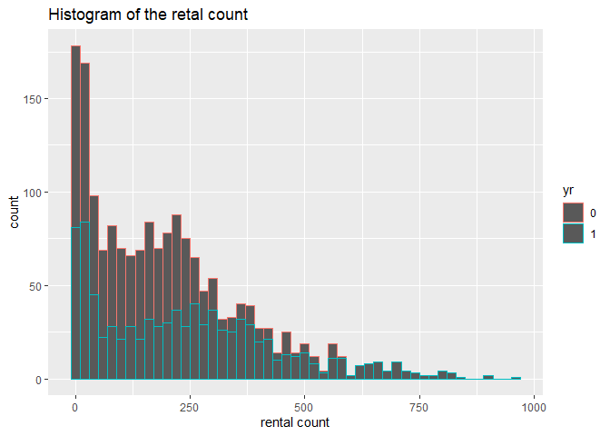
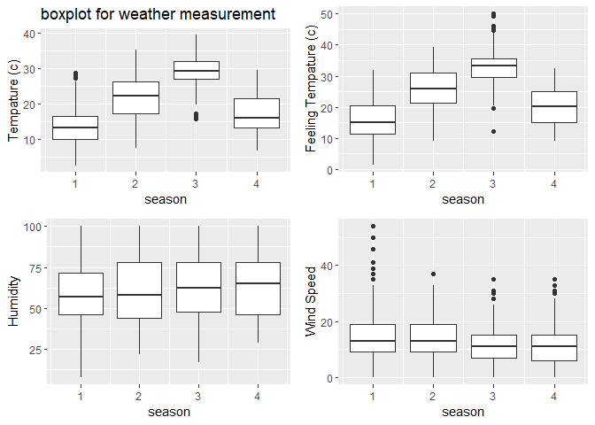
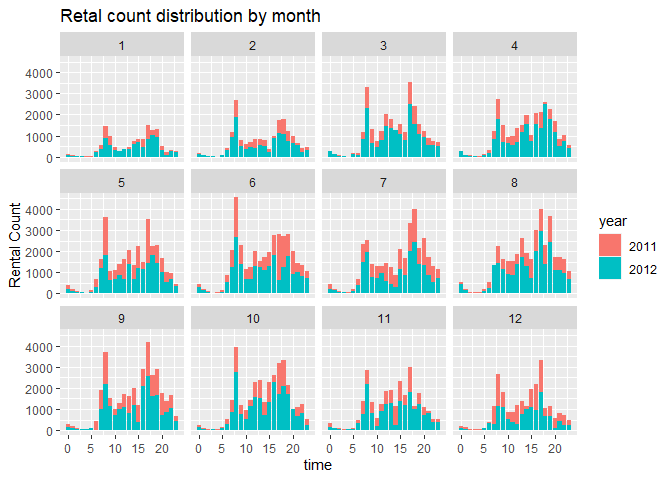
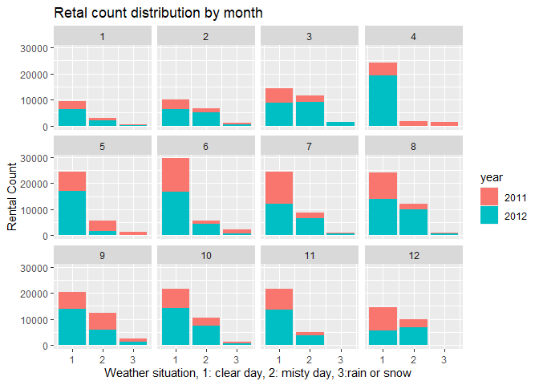
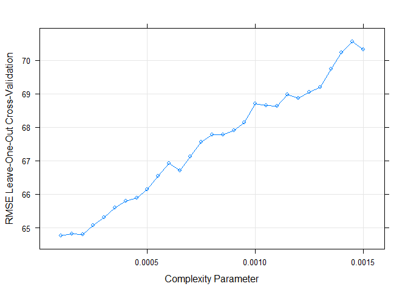
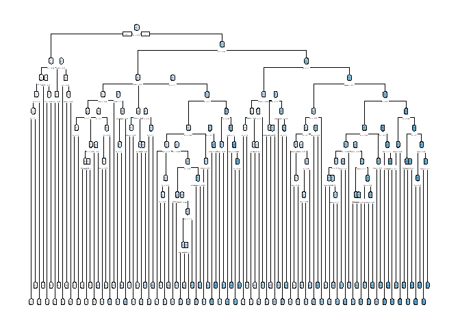
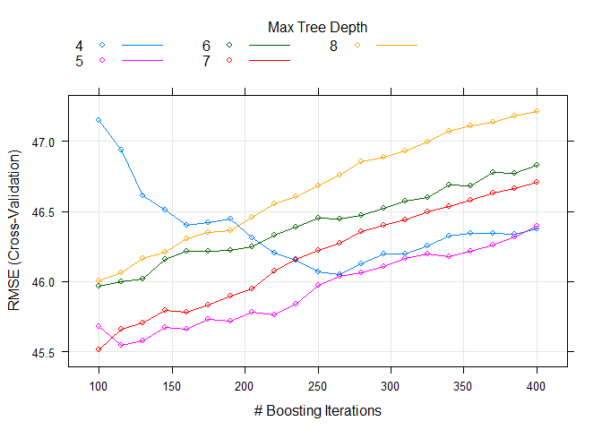
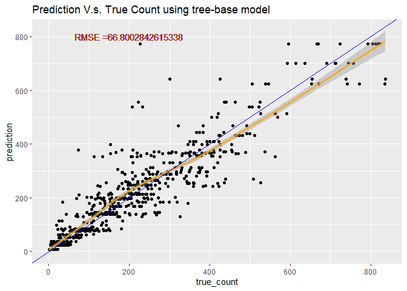
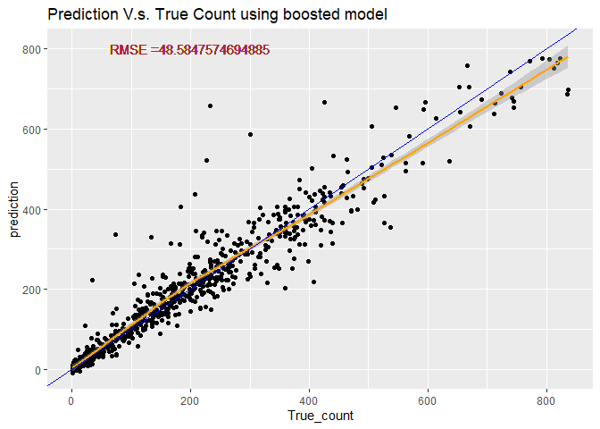

# Require package

```r
#install.packages("render")
library(knitr)
library(rmarkdown)
library(MuMIn)
library(tidyverse)
library(caret)
library(corrplot)
library(readxl)
library(caret)
library(ggiraphExtra)
library(knitr)
library(ggplot2)
library(ggpubr)
library(rpart.plot)
library(rpart)
library(DT)
```

# Read in data

```r
#read in hour data
HourData <- read.csv("hour.csv")
HourData<- HourData %>% select(-casual, -registered)
HourData$yr <- as.factor(HourData$yr)
HourData$holiday <- as.factor(HourData$holiday)
HourData$workingday <- as.factor(HourData$workingday)

#filter data by weekday
HourData <-HourData %>% filter(weekday==params$w)
#showing data
HourData <-HourData %>% select(-weekday, -workingday,-instant)
tbl_df(HourData)
```

```
## # A tibble: 2,487 x 12
##    dteday season yr     mnth    hr holiday weathersit  temp atemp   hum
##    <chr>   <int> <fct> <int> <int> <fct>        <int> <dbl> <dbl> <dbl>
##  1 2011-~      1 0         1     0 0                2  0.2  0.197  0.64
##  2 2011-~      1 0         1     1 0                2  0.2  0.197  0.69
##  3 2011-~      1 0         1     2 0                2  0.2  0.197  0.69
##  4 2011-~      1 0         1     4 0                2  0.2  0.212  0.69
##  5 2011-~      1 0         1     5 0                3  0.22 0.273  0.55
##  6 2011-~      1 0         1     6 0                2  0.2  0.258  0.69
##  7 2011-~      1 0         1     7 0                1  0.2  0.212  0.69
##  8 2011-~      1 0         1     8 0                1  0.2  0.197  0.51
##  9 2011-~      1 0         1     9 0                1  0.2  0.182  0.47
## 10 2011-~      1 0         1    10 0                1  0.22 0.197  0.37
## # ... with 2,477 more rows, and 2 more variables: windspeed <dbl>, cnt <int>
```

```r
#Separate dataset into train (70%) and test (30%) data set
set.seed(1997)
train <- sample(1:nrow(HourData), size = nrow(HourData)*0.7)
test <- dplyr::setdiff(1:nrow(HourData), train)
HourDataTrain <- HourData[train, ]
HourDataTest <- HourData[test, ]
```

# Summarize the training data

```r
# plot the histogram of rental count
hist <- ggplot(data=HourDataTrain, aes(x=cnt))+geom_histogram(binwidth = 20, aes(color=yr))
hist <-hist+labs(title="Histogram of the retal count", x="rental count")
hist <-hist+scale_fill_discrete(labels=c(2011,2012))
hist
```



```r
#prin out summary table for tempature humidity and windspeed
sum <- HourDataTrain%>% select(c(temp, atemp, hum, windspeed))
kable(apply(sum, 2,summary), caption="Numeric Summary for weather measurement")
```


Table: Numeric Summary for weather measurement

|        |      temp|     atemp|       hum| windspeed|
|:-------|---------:|---------:|---------:|---------:|
|Min.    | 0.0600000| 0.0303000| 0.0800000|  0.000000|
|1st Qu. | 0.3400000| 0.3182000| 0.4600000|  0.104500|
|Median  | 0.5000000| 0.4848000| 0.6100000|  0.164200|
|Mean    | 0.4982184| 0.4727968| 0.6115805|  0.185808|
|3rd Qu. | 0.6600000| 0.6212000| 0.7600000|  0.253700|
|Max.    | 0.9600000| 1.0000000| 1.0000000|  0.806000|

```r
#plot the boxplot of tempature humidity and windspeed (not genralized amount)
#plot base
boxplot <- ggplot(data = HourDataTrain, aes(x=season))
#adding 4 variables
tem <-boxplot+geom_boxplot(aes(y=temp*41, group=season))+labs(y="Tempature (c)", title = "boxplot for weather measurement")
fetem <-boxplot+geom_boxplot(aes(y=atemp*50, group=season))+labs(y="Feeling Tempature (c)")
hum <-boxplot+geom_boxplot(aes(y=hum*100, group=season))+labs(y="Humidity")
wind <-boxplot+geom_boxplot(aes(y=windspeed*67, group=season))+labs(y="Wind Speed")
#combine 4 plots into 1
ggarrange(tem, fetem, hum , wind, ncol = 2, nrow = 2)
```



```r
# plot the count distribution among time and weather
# by time
barplot1<-ggplot(data = HourDataTrain, aes(x=hr))+geom_col(aes(y=cnt, fill=yr))+facet_wrap(~mnth)
barplot1 <- barplot1+labs(x="time", y="Rental Count", title="Retal count distribution by month" )
barplot1+scale_fill_discrete(name="year", labels=c(2011,2012))
```



```r
# by weather
barplot2 <-ggplot(data = HourDataTrain, aes(x=weathersit))+geom_col(aes(y=cnt, fill=yr))+facet_wrap(~mnth)
barplot2 <- barplot2+labs(x="Weather situation, 1: clear day, 2: misty day, 3:rain or snow", y="Rental Count", title="Retal count distribution by month" )
barplot2+scale_fill_discrete(name="year", labels=c(2011,2012))
```



# Training Model
Here I use two different method, First one useing a tree-based models using leave one out cross validation. Second, I use the boosted tree model with cross validation. Both two training are done using the `train` function from `caret` package. The data was cantered and scaled before training.Since our response variables is continuous response, I choose to use Regression tree.

## Tree-based model

```r
# set up training control, using leave one out cross validation.
set.seed(615)
trctrl <- trainControl(method = "LOOCV", number = 1)

# getModelInfo("rpart")
# training using regression tree models with cp in [0.001, 0.002]
# since the cp seems have to be really small when I used the default cp to train

model1 <- cnt~season+yr+mnth+hr+holiday+weathersit+temp+atemp+hum+windspeed

RegTree_fit1 <- train(model1, data = HourDataTrain, method = "rpart",
                 trControl=trctrl,
                 preProcess = c("center", "scale"),
                 tuneGrid=expand.grid(cp=seq(0.0001,0.0015,0.00005))
)

# show the training result
RegTree_fit1
```

```
## CART 
## 
## 1740 samples
##   10 predictor
## 
## Pre-processing: centered (10), scaled (10) 
## Resampling: Leave-One-Out Cross-Validation 
## Summary of sample sizes: 1739, 1739, 1739, 1739, 1739, 1739, ... 
## Resampling results across tuning parameters:
## 
##   cp       RMSE      Rsquared   MAE     
##   0.00010  64.77218  0.8633108  38.55849
##   0.00015  64.82577  0.8630776  38.60202
##   0.00020  64.80390  0.8631401  38.63873
##   0.00025  65.07272  0.8620448  39.62420
##   0.00030  65.30849  0.8610317  39.89369
##   0.00035  65.59466  0.8598016  40.27445
##   0.00040  65.79272  0.8589180  40.51899
##   0.00045  65.88810  0.8585593  40.52681
##   0.00050  66.14625  0.8574950  40.86600
##   0.00055  66.54037  0.8557543  41.35291
##   0.00060  66.92791  0.8541330  41.82871
##   0.00065  66.70782  0.8550749  41.54969
##   0.00070  67.12656  0.8533004  41.85694
##   0.00075  67.56294  0.8514578  42.29372
##   0.00080  67.78029  0.8505301  42.31973
##   0.00085  67.78732  0.8502437  42.47780
##   0.00090  67.89912  0.8497182  42.65777
##   0.00095  68.14626  0.8485980  43.06725
##   0.00100  68.71210  0.8460461  43.90605
##   0.00105  68.65181  0.8462268  43.92652
##   0.00110  68.63073  0.8463214  43.84655
##   0.00115  68.97360  0.8448382  43.85088
##   0.00120  68.86847  0.8453036  43.50390
##   0.00125  69.05131  0.8444841  43.58443
##   0.00130  69.19454  0.8437790  43.77568
##   0.00135  69.73535  0.8412919  44.31043
##   0.00140  70.23546  0.8389563  44.91191
##   0.00145  70.54993  0.8374325  45.38260
##   0.00150  70.31559  0.8384128  45.20697
## 
## RMSE was used to select the optimal model using the smallest value.
## The final value used for the model was cp = 1e-04.
```

```r
# plot the RMSE of selected cp
plot(RegTree_fit1)
```



```r
# plot my final tree model
rpart.plot(RegTree_fit1$finalModel)
```



## Boosted tree model

```r
# set up training control, using cross validation with 10 folder
set.seed(615)
trctrl <- trainControl(method = "cv", number = 10)

# training using boosted tree models with boosting interation in [200,400] and try max tree depth 5~9
model2 <- cnt~season+yr+mnth+hr+holiday+weathersit+temp+atemp+hum+windspeed
RegTree_fit2 <- train(model2, data = HourDataTrain, method = "bstTree",
                trControl=trctrl,
                preProcess = c("center", "scale"),
                tuneGrid=expand.grid(mstop=seq(100,400,15),
                                     maxdepth=4:8, nu=0.1)
                 )

# show the training result
RegTree_fit2
```

```
## Boosted Tree 
## 
## 1740 samples
##   10 predictor
## 
## Pre-processing: centered (10), scaled (10) 
## Resampling: Cross-Validated (10 fold) 
## Summary of sample sizes: 1566, 1565, 1565, 1566, 1566, 1567, ... 
## Resampling results across tuning parameters:
## 
##   maxdepth  mstop  RMSE      Rsquared   MAE     
##   4         100    47.14683  0.9265714  28.92319
##   4         115    46.93769  0.9270447  28.72153
##   4         130    46.61021  0.9278315  28.40617
##   4         145    46.51240  0.9279807  28.22487
##   4         160    46.39906  0.9282341  28.10414
##   4         175    46.42358  0.9281226  28.04134
##   4         190    46.44570  0.9280723  27.97068
##   4         205    46.30945  0.9285053  27.87687
##   4         220    46.20451  0.9288437  27.77559
##   4         235    46.15369  0.9289915  27.73148
##   4         250    46.07006  0.9292287  27.72450
##   4         265    46.05364  0.9293446  27.74579
##   4         280    46.12561  0.9291115  27.75799
##   4         295    46.19768  0.9288941  27.78274
##   4         310    46.19612  0.9289574  27.79085
##   4         325    46.25630  0.9287693  27.86410
##   4         340    46.32835  0.9285459  27.91115
##   4         355    46.34605  0.9285147  27.91151
##   4         370    46.34202  0.9285270  27.88186
##   4         385    46.33595  0.9285348  27.91497
##   4         400    46.37601  0.9284219  27.94007
##   5         100    45.68157  0.9305288  27.00399
##   5         115    45.54680  0.9308615  26.85807
##   5         130    45.57493  0.9306992  26.86846
##   5         145    45.67210  0.9303564  26.89236
##   5         160    45.65769  0.9302949  26.87053
##   5         175    45.73274  0.9300769  26.89831
##   5         190    45.71875  0.9300475  26.87290
##   5         205    45.77973  0.9298773  26.94959
##   5         220    45.76253  0.9298776  26.95083
##   5         235    45.83926  0.9296405  26.99141
##   5         250    45.97202  0.9292222  27.05847
##   5         265    46.03641  0.9290690  27.10078
##   5         280    46.06579  0.9289925  27.10898
##   5         295    46.10719  0.9288863  27.14602
##   5         310    46.16686  0.9287060  27.19555
##   5         325    46.20004  0.9286096  27.22468
##   5         340    46.17865  0.9286777  27.24996
##   5         355    46.21556  0.9285542  27.29842
##   5         370    46.26227  0.9284178  27.34918
##   5         385    46.31850  0.9282978  27.40487
##   5         400    46.39549  0.9280727  27.44253
##   6         100    45.96440  0.9291590  27.04854
##   6         115    45.99840  0.9289962  27.10553
##   6         130    46.01627  0.9288907  27.10269
##   6         145    46.16175  0.9284306  27.14887
##   6         160    46.21648  0.9282544  27.21306
##   6         175    46.21942  0.9282413  27.26743
##   6         190    46.22129  0.9282399  27.29683
##   6         205    46.24819  0.9281415  27.34382
##   6         220    46.33218  0.9278509  27.40543
##   6         235    46.38988  0.9276393  27.41990
##   6         250    46.45104  0.9274757  27.49664
##   6         265    46.44572  0.9274690  27.49554
##   6         280    46.46979  0.9273499  27.49900
##   6         295    46.52116  0.9271731  27.53932
##   6         310    46.57366  0.9270073  27.57411
##   6         325    46.59958  0.9269709  27.64325
##   6         340    46.68950  0.9266720  27.71049
##   6         355    46.68619  0.9266927  27.71188
##   6         370    46.77812  0.9264441  27.77192
##   6         385    46.77400  0.9264790  27.77086
##   6         400    46.83157  0.9262953  27.80924
##   7         100    45.51237  0.9308900  26.70695
##   7         115    45.66086  0.9303807  26.76936
##   7         130    45.70783  0.9302118  26.78540
##   7         145    45.79494  0.9299547  26.83284
##   7         160    45.78338  0.9299626  26.88702
##   7         175    45.83239  0.9297903  26.95064
##   7         190    45.89399  0.9295967  27.03363
##   7         205    45.94728  0.9294162  27.06822
##   7         220    46.07723  0.9290307  27.15529
##   7         235    46.16185  0.9287338  27.24411
##   7         250    46.22289  0.9285558  27.27974
##   7         265    46.27130  0.9283819  27.34034
##   7         280    46.35670  0.9281256  27.38570
##   7         295    46.40400  0.9279650  27.40156
##   7         310    46.44215  0.9278503  27.47359
##   7         325    46.49915  0.9276537  27.52556
##   7         340    46.53866  0.9275326  27.55083
##   7         355    46.58152  0.9273806  27.59189
##   7         370    46.63027  0.9272422  27.62608
##   7         385    46.66156  0.9271422  27.65859
##   7         400    46.70634  0.9270128  27.67969
##   8         100    46.00752  0.9293912  26.81837
##   8         115    46.06196  0.9291568  26.88876
##   8         130    46.16479  0.9288265  26.99435
##   8         145    46.21348  0.9286764  27.08191
##   8         160    46.30751  0.9283917  27.12110
##   8         175    46.35017  0.9282487  27.14261
##   8         190    46.36398  0.9282275  27.19256
##   8         205    46.45966  0.9279621  27.27259
##   8         220    46.55299  0.9276963  27.37624
##   8         235    46.60854  0.9275103  27.42322
##   8         250    46.68051  0.9273070  27.48170
##   8         265    46.76286  0.9270683  27.53260
##   8         280    46.85478  0.9267912  27.60799
##   8         295    46.88619  0.9266787  27.64098
##   8         310    46.93521  0.9265181  27.66865
##   8         325    46.99690  0.9263361  27.71769
##   8         340    47.07022  0.9261189  27.76302
##   8         355    47.10947  0.9259741  27.78202
##   8         370    47.13661  0.9258877  27.78941
##   8         385    47.18184  0.9257508  27.83872
##   8         400    47.21063  0.9256613  27.85809
## 
## Tuning parameter 'nu' was held constant at a value of 0.1
## RMSE was used to select the optimal model using the smallest value.
## The final values used for the model were mstop = 100, maxdepth = 7 and nu = 0.1.
```

```r
# plot the RMSE of selected parameters
plot(RegTree_fit2)
```




# Predicting using the best tree-base model 

```r
# predict use predict function
tree_pred <- predict(RegTree_fit1, newdata = HourDataTest)

#Calculate the Root MSE
RMSE_tree<- sqrt(mean((tree_pred-HourDataTest$cnt)^2))
label <- paste0("RMSE =", RMSE_tree)

# plot the prediction
count <- data.frame(true_count=HourDataTest$cnt,prediction=tree_pred )
predPlot <- ggplot(data=count, aes(x=true_count,y=prediction))
predPlot <- predPlot+labs(title="Prediction V.s. True Count using tree-base model")+geom_point()
predPlot <- predPlot+geom_smooth(color="orange")+geom_abline(aes(intercept=0,slope=1), color="blue")
predPlot <- predPlot+geom_text(x=200, y=800,label=label, color="brown")
predPlot
```



# Predicting using the best boosted-tree model 

```r
# predict use predict function
boosted_pred <- predict(RegTree_fit2, newdata = HourDataTest)

#Calculate the Root MSE
RMSE_boosted <- sqrt(mean((boosted_pred-HourDataTest$cnt)^2))
lab <- paste0("RMSE =", RMSE_boosted)
# plot the prediction
count2 <- data.frame(True_count=HourDataTest$cnt,prediction=boosted_pred )
pred_plot <- ggplot(data=count2, aes(x=True_count,y=prediction))
pred_plot <- pred_plot+labs(title="Prediction V.s. True Count using boosted model")+geom_point()
pred_plot <- pred_plot+geom_smooth(color="orange")+geom_abline(aes(intercept=0,slope=1), color="blue")
pred_plot <- pred_plot+geom_text(x=200, y=800,label=lab, color=" brown")
pred_plot
```


