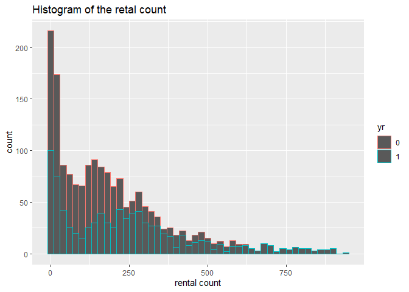
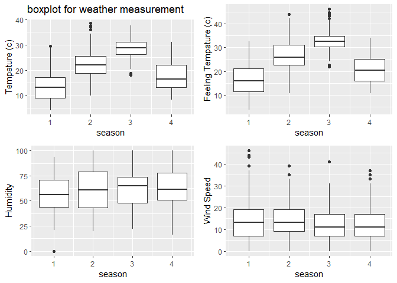
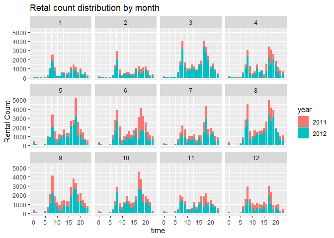
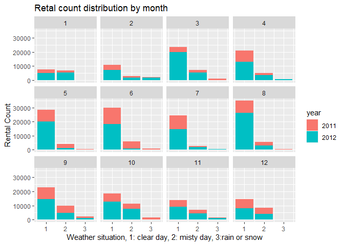
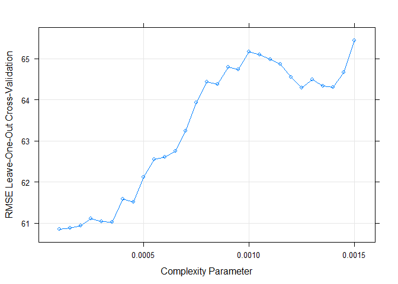
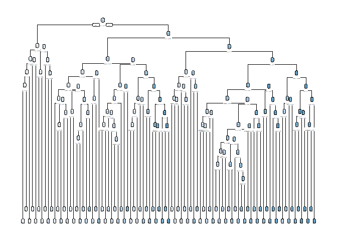
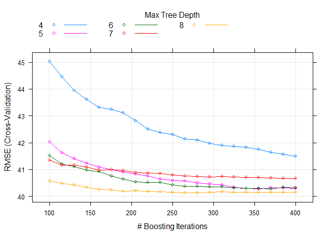
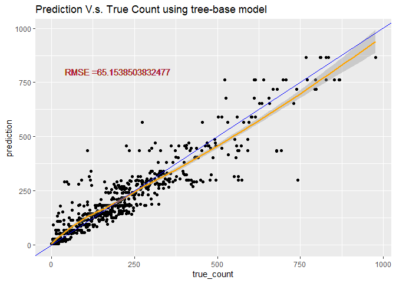
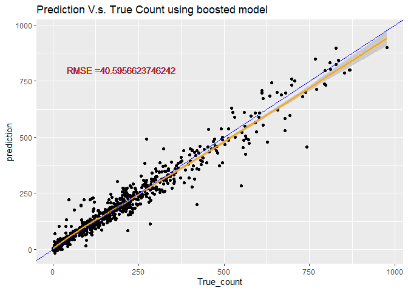

# Require package

```r
#install.packages("render")
library(knitr)
library(rmarkdown)
library(MuMIn)
library(tidyverse)
library(caret)
library(corrplot)
library(readxl)
library(caret)
library(ggiraphExtra)
library(knitr)
library(ggplot2)
library(ggpubr)
library(rpart.plot)
library(rpart)
library(DT)
```

# Read in data

```r
#read in hour data
HourData <- read.csv("hour.csv")
HourData<- HourData %>% select(-casual, -registered)
HourData$yr <- as.factor(HourData$yr)
HourData$holiday <- as.factor(HourData$holiday)
HourData$workingday <- as.factor(HourData$workingday)

#filter data by weekday
HourData <-HourData %>% filter(weekday==params$w)
#showing data
HourData <-HourData %>% select(-weekday, -workingday,-instant)
tbl_df(HourData)
```

```
## # A tibble: 2,471 x 12
##    dteday season yr     mnth    hr holiday weathersit  temp atemp   hum
##    <chr>   <int> <fct> <int> <int> <fct>        <int> <dbl> <dbl> <dbl>
##  1 2011-~      1 0         1     0 0                1  0.18 0.242  0.55
##  2 2011-~      1 0         1     1 0                1  0.16 0.227  0.64
##  3 2011-~      1 0         1     2 0                1  0.16 0.227  0.64
##  4 2011-~      1 0         1     4 0                2  0.16 0.197  0.64
##  5 2011-~      1 0         1     5 0                2  0.14 0.182  0.69
##  6 2011-~      1 0         1     6 0                2  0.14 0.167  0.63
##  7 2011-~      1 0         1     7 0                2  0.16 0.227  0.59
##  8 2011-~      1 0         1     8 0                1  0.16 0.227  0.59
##  9 2011-~      1 0         1     9 0                2  0.18 0.242  0.51
## 10 2011-~      1 0         1    10 0                1  0.2  0.258  0.47
## # ... with 2,461 more rows, and 2 more variables: windspeed <dbl>, cnt <int>
```

```r
#Separate dataset into train (70%) and test (30%) data set
set.seed(1997)
train <- sample(1:nrow(HourData), size = nrow(HourData)*0.7)
test <- dplyr::setdiff(1:nrow(HourData), train)
HourDataTrain <- HourData[train, ]
HourDataTest <- HourData[test, ]
```

# Summarize the training data

```r
# plot the histogram of rental count
hist <- ggplot(data=HourDataTrain, aes(x=cnt))+geom_histogram(binwidth = 20, aes(color=yr))
hist <-hist+labs(title="Histogram of the retal count", x="rental count")
hist <-hist+scale_fill_discrete(labels=c(2011,2012))
hist
```



```r
#prin out summary table for tempature humidity and windspeed
sum <- HourDataTrain%>% select(c(temp, atemp, hum, windspeed))
kable(apply(sum, 2,summary), caption="Numeric Summary for weather measurement")
```


Table: Numeric Summary for weather measurement

|        |      temp|     atemp|       hum| windspeed|
|:-------|---------:|---------:|---------:|---------:|
|Min.    | 0.1000000| 0.0758000| 0.0000000| 0.0000000|
|1st Qu. | 0.3400000| 0.3333000| 0.4700000| 0.1045000|
|Median  | 0.5000000| 0.4848000| 0.6100000| 0.1940000|
|Mean    | 0.5064199| 0.4842271| 0.6132678| 0.1907718|
|3rd Qu. | 0.6600000| 0.6212000| 0.7700000| 0.2537000|
|Max.    | 0.9400000| 0.9242000| 1.0000000| 0.6866000|

```r
#plot the boxplot of tempature humidity and windspeed (not genralized amount)
#plot base
boxplot <- ggplot(data = HourDataTrain, aes(x=season))
#adding 4 variables
tem <-boxplot+geom_boxplot(aes(y=temp*41, group=season))+labs(y="Tempature (c)", title = "boxplot for weather measurement")
fetem <-boxplot+geom_boxplot(aes(y=atemp*50, group=season))+labs(y="Feeling Tempature (c)")
hum <-boxplot+geom_boxplot(aes(y=hum*100, group=season))+labs(y="Humidity")
wind <-boxplot+geom_boxplot(aes(y=windspeed*67, group=season))+labs(y="Wind Speed")
#combine 4 plots into 1
ggarrange(tem, fetem, hum , wind, ncol = 2, nrow = 2)
```



```r
# plot the count distribution among time and weather
# by time
barplot1<-ggplot(data = HourDataTrain, aes(x=hr))+geom_col(aes(y=cnt, fill=yr))+facet_wrap(~mnth)
barplot1 <- barplot1+labs(x="time", y="Rental Count", title="Retal count distribution by month" )
barplot1+scale_fill_discrete(name="year", labels=c(2011,2012))
```



```r
# by weather
barplot2 <-ggplot(data = HourDataTrain, aes(x=weathersit))+geom_col(aes(y=cnt, fill=yr))+facet_wrap(~mnth)
barplot2 <- barplot2+labs(x="Weather situation, 1: clear day, 2: misty day, 3:rain or snow", y="Rental Count", title="Retal count distribution by month" )
barplot2+scale_fill_discrete(name="year", labels=c(2011,2012))
```



# Training Model
Here I use two different method, First one useing a tree-based models using leave one out cross validation. Second, I use the boosted tree model with cross validation. Both two training are done using the `train` function from `caret` package. The data was cantered and scaled before training.Since our response variables is continuous response, I choose to use Regression tree.

## Tree-based model

```r
# set up training control, using leave one out cross validation.
set.seed(615)
trctrl <- trainControl(method = "LOOCV", number = 1)

# getModelInfo("rpart")
# training using regression tree models with cp in [0.001, 0.002]
# since the cp seems have to be really small when I used the default cp to train

model1 <- cnt~season+yr+mnth+hr+holiday+weathersit+temp+atemp+hum+windspeed

RegTree_fit1 <- train(model1, data = HourDataTrain, method = "rpart",
                 trControl=trctrl,
                 preProcess = c("center", "scale"),
                 tuneGrid=expand.grid(cp=seq(0.0001,0.0015,0.00005))
)

# show the training result
RegTree_fit1
```

```
## CART 
## 
## 1729 samples
##   10 predictor
## 
## Pre-processing: centered (10), scaled (10) 
## Resampling: Leave-One-Out Cross-Validation 
## Summary of sample sizes: 1728, 1728, 1728, 1728, 1728, 1728, ... 
## Resampling results across tuning parameters:
## 
##   cp       RMSE      Rsquared   MAE     
##   0.00010  60.86147  0.8970593  36.61289
##   0.00015  60.88114  0.8969754  37.05573
##   0.00020  60.93514  0.8967628  37.17948
##   0.00025  61.10853  0.8961637  37.72591
##   0.00030  61.03935  0.8963359  38.20563
##   0.00035  61.02753  0.8963249  38.19450
##   0.00040  61.59122  0.8944547  38.49041
##   0.00045  61.51989  0.8947203  38.53477
##   0.00050  62.12086  0.8926813  39.15997
##   0.00055  62.55968  0.8911302  39.92220
##   0.00060  62.60356  0.8909658  40.09264
##   0.00065  62.76110  0.8904512  40.24136
##   0.00070  63.24455  0.8889244  40.77349
##   0.00075  63.93642  0.8863391  41.47493
##   0.00080  64.44389  0.8845214  42.47339
##   0.00085  64.38671  0.8846123  42.43957
##   0.00090  64.79159  0.8832039  42.60157
##   0.00095  64.74289  0.8833530  42.68422
##   0.00100  65.16811  0.8818151  43.20802
##   0.00105  65.10290  0.8820520  43.09758
##   0.00110  64.98235  0.8824622  42.85010
##   0.00115  64.86321  0.8828654  42.78314
##   0.00120  64.55222  0.8839874  42.75323
##   0.00125  64.28860  0.8849158  42.61439
##   0.00130  64.48762  0.8842087  42.62210
##   0.00135  64.33730  0.8847553  42.49845
##   0.00140  64.31086  0.8848436  42.50300
##   0.00145  64.66212  0.8835996  42.73621
##   0.00150  65.43788  0.8808291  43.33507
## 
## RMSE was used to select the optimal model using the smallest value.
## The final value used for the model was cp = 1e-04.
```

```r
# plot the RMSE of selected cp
plot(RegTree_fit1)
```



```r
# plot my final tree model
rpart.plot(RegTree_fit1$finalModel)
```



## Boosted tree model

```r
# set up training control, using cross validation with 10 folder
set.seed(615)
trctrl <- trainControl(method = "cv", number = 10)

# training using boosted tree models with boosting interation in [200,400] and try max tree depth 5~9
model2 <- cnt~season+yr+mnth+hr+holiday+weathersit+temp+atemp+hum+windspeed
RegTree_fit2 <- train(model2, data = HourDataTrain, method = "bstTree",
                trControl=trctrl,
                preProcess = c("center", "scale"),
                tuneGrid=expand.grid(mstop=seq(100,400,15),
                                     maxdepth=4:8, nu=0.1)
                 )

# show the training result
RegTree_fit2
```

```
## Boosted Tree 
## 
## 1729 samples
##   10 predictor
## 
## Pre-processing: centered (10), scaled (10) 
## Resampling: Cross-Validated (10 fold) 
## Summary of sample sizes: 1555, 1557, 1555, 1556, 1556, 1557, ... 
## Resampling results across tuning parameters:
## 
##   maxdepth  mstop  RMSE      Rsquared   MAE     
##   4         100    45.02158  0.9438965  28.29925
##   4         115    44.46574  0.9451149  27.99394
##   4         130    43.94596  0.9462847  27.69599
##   4         145    43.61696  0.9470143  27.51445
##   4         160    43.31222  0.9477583  27.33844
##   4         175    43.25030  0.9479017  27.28992
##   4         190    43.10898  0.9482584  27.20466
##   4         205    42.81587  0.9488944  26.99757
##   4         220    42.50247  0.9495966  26.82544
##   4         235    42.38440  0.9498472  26.70732
##   4         250    42.30084  0.9500553  26.65260
##   4         265    42.14065  0.9504558  26.56572
##   4         280    42.10107  0.9505369  26.53335
##   4         295    41.97812  0.9508579  26.48016
##   4         310    41.90013  0.9510301  26.44804
##   4         325    41.86633  0.9511459  26.45236
##   4         340    41.82391  0.9512376  26.42700
##   4         355    41.75661  0.9514059  26.41351
##   4         370    41.64665  0.9516429  26.36192
##   4         385    41.56822  0.9518315  26.34113
##   4         400    41.48611  0.9520309  26.29718
##   5         100    42.02577  0.9507168  25.98131
##   5         115    41.63048  0.9516108  25.67628
##   5         130    41.40902  0.9521259  25.55045
##   5         145    41.23179  0.9525344  25.44258
##   5         160    41.09649  0.9528211  25.38370
##   5         175    40.99205  0.9530673  25.37111
##   5         190    40.90158  0.9533197  25.31984
##   5         205    40.83473  0.9534841  25.28555
##   5         220    40.75383  0.9536255  25.21424
##   5         235    40.65054  0.9538686  25.17624
##   5         250    40.58869  0.9540066  25.15103
##   5         265    40.56867  0.9540332  25.11060
##   5         280    40.49934  0.9541892  25.09894
##   5         295    40.46558  0.9542704  25.07496
##   5         310    40.42827  0.9543833  25.06643
##   5         325    40.33201  0.9546176  25.04295
##   5         340    40.29989  0.9546692  25.05241
##   5         355    40.27619  0.9547224  25.04337
##   5         370    40.31236  0.9546290  25.06655
##   5         385    40.32552  0.9546010  25.05842
##   5         400    40.30175  0.9546362  25.05630
##   6         100    41.50657  0.9516135  25.00800
##   6         115    41.20925  0.9522767  24.87736
##   6         130    41.11646  0.9524870  24.81399
##   6         145    40.98348  0.9527793  24.79384
##   6         160    40.92144  0.9529563  24.78515
##   6         175    40.76528  0.9533267  24.73804
##   6         190    40.63928  0.9535901  24.69109
##   6         205    40.54621  0.9537942  24.65740
##   6         220    40.52730  0.9538384  24.69347
##   6         235    40.52384  0.9538439  24.70071
##   6         250    40.43584  0.9540641  24.69119
##   6         265    40.37971  0.9542031  24.65079
##   6         280    40.36746  0.9542398  24.67194
##   6         295    40.35752  0.9542753  24.66474
##   6         310    40.34933  0.9542794  24.67142
##   6         325    40.31507  0.9543752  24.66833
##   6         340    40.30104  0.9544148  24.66619
##   6         355    40.29525  0.9544300  24.68288
##   6         370    40.28336  0.9544799  24.68423
##   6         385    40.32827  0.9543685  24.71775
##   6         400    40.30976  0.9544324  24.72201
##   7         100    41.34260  0.9517435  24.89711
##   7         115    41.16666  0.9520987  24.83129
##   7         130    41.15685  0.9521214  24.84351
##   7         145    41.08166  0.9523073  24.83836
##   7         160    40.98087  0.9525017  24.82894
##   7         175    40.99465  0.9524812  24.85549
##   7         190    40.95390  0.9525808  24.84944
##   7         205    40.87854  0.9527702  24.81939
##   7         220    40.87441  0.9527934  24.82347
##   7         235    40.84950  0.9528701  24.80600
##   7         250    40.78941  0.9530055  24.79712
##   7         265    40.75224  0.9530996  24.79465
##   7         280    40.73195  0.9531575  24.80533
##   7         295    40.72879  0.9531848  24.79166
##   7         310    40.74061  0.9531801  24.81225
##   7         325    40.73015  0.9531962  24.80586
##   7         340    40.71018  0.9532486  24.80610
##   7         355    40.70605  0.9532596  24.83800
##   7         370    40.68130  0.9533218  24.84821
##   7         385    40.67092  0.9533417  24.84376
##   7         400    40.66164  0.9533684  24.85155
##   8         100    40.58357  0.9535835  24.61759
##   8         115    40.48947  0.9537953  24.58820
##   8         130    40.41867  0.9539461  24.57296
##   8         145    40.34100  0.9541122  24.55134
##   8         160    40.26438  0.9542963  24.53964
##   8         175    40.23910  0.9543483  24.54990
##   8         190    40.19128  0.9544568  24.54378
##   8         205    40.20822  0.9544175  24.59453
##   8         220    40.18009  0.9544845  24.59474
##   8         235    40.17497  0.9545019  24.62104
##   8         250    40.15782  0.9545330  24.61958
##   8         265    40.13561  0.9545879  24.59526
##   8         280    40.12858  0.9546137  24.59972
##   8         295    40.15273  0.9545775  24.61606
##   8         310    40.16146  0.9545472  24.63271
##   8         325    40.14365  0.9545798  24.63545
##   8         340    40.14236  0.9545910  24.63988
##   8         355    40.15340  0.9545732  24.65907
##   8         370    40.15085  0.9545941  24.67070
##   8         385    40.14930  0.9546005  24.68014
##   8         400    40.15642  0.9545830  24.68604
## 
## Tuning parameter 'nu' was held constant at a value of 0.1
## RMSE was used to select the optimal model using the smallest value.
## The final values used for the model were mstop = 280, maxdepth = 8 and nu = 0.1.
```

```r
# plot the RMSE of selected parameters
plot(RegTree_fit2)
```




# Predicting using the best tree-base model 

```r
# predict use predict function
tree_pred <- predict(RegTree_fit1, newdata = HourDataTest)

#Calculate the Root MSE
RMSE_tree<- sqrt(mean((tree_pred-HourDataTest$cnt)^2))
label <- paste0("RMSE =", RMSE_tree)

# plot the prediction
count <- data.frame(true_count=HourDataTest$cnt,prediction=tree_pred )
predPlot <- ggplot(data=count, aes(x=true_count,y=prediction))
predPlot <- predPlot+labs(title="Prediction V.s. True Count using tree-base model")+geom_point()
predPlot <- predPlot+geom_smooth(color="orange")+geom_abline(aes(intercept=0,slope=1), color="blue")
predPlot <- predPlot+geom_text(x=200, y=800,label=label, color="brown")
predPlot
```



# Predicting using the best boosted-tree model 

```r
# predict use predict function
boosted_pred <- predict(RegTree_fit2, newdata = HourDataTest)

#Calculate the Root MSE
RMSE_boosted <- sqrt(mean((boosted_pred-HourDataTest$cnt)^2))
lab <- paste0("RMSE =", RMSE_boosted)
# plot the prediction
count2 <- data.frame(True_count=HourDataTest$cnt,prediction=boosted_pred )
pred_plot <- ggplot(data=count2, aes(x=True_count,y=prediction))
pred_plot <- pred_plot+labs(title="Prediction V.s. True Count using boosted model")+geom_point()
pred_plot <- pred_plot+geom_smooth(color="orange")+geom_abline(aes(intercept=0,slope=1), color="blue")
pred_plot <- pred_plot+geom_text(x=200, y=800,label=lab, color=" brown")
pred_plot
```


