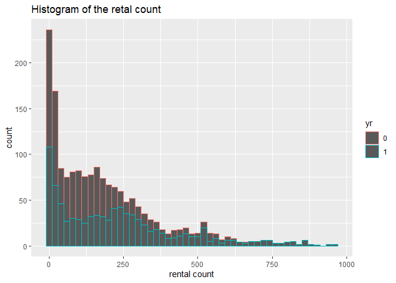
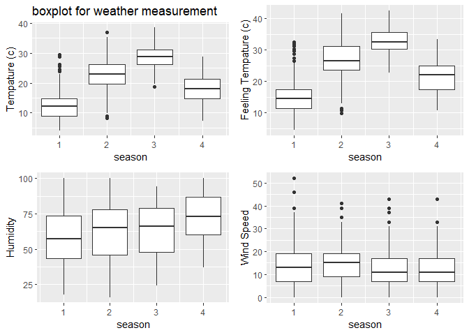
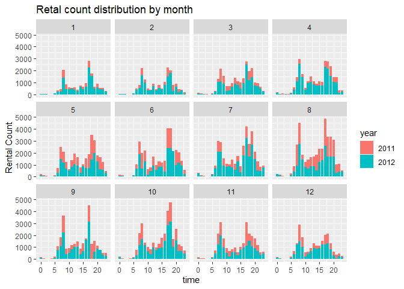
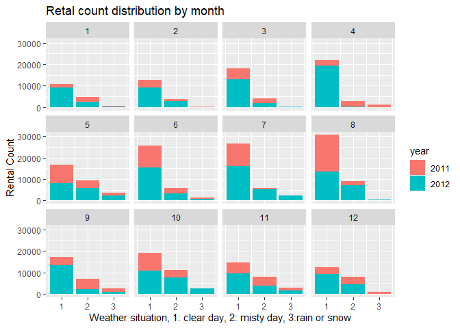
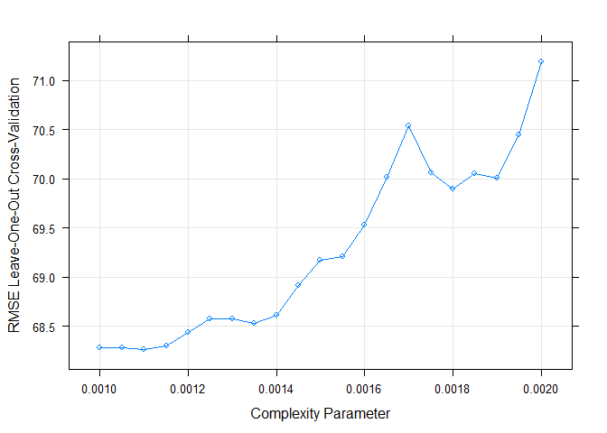
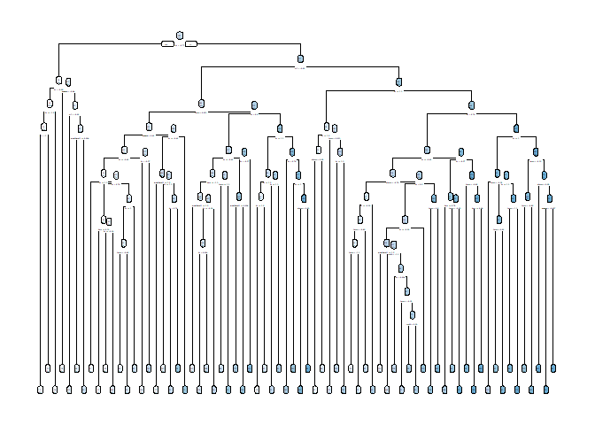
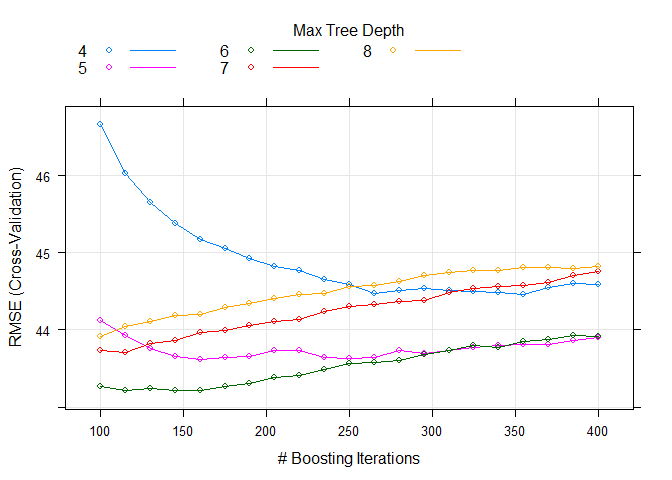
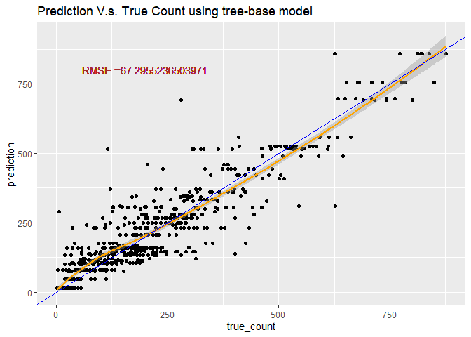
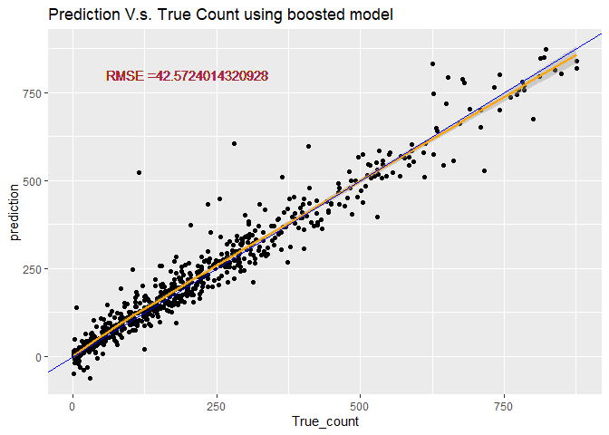

# Require package

```r
#install.packages("render")
library(knitr)
library(rmarkdown)
library(MuMIn)
library(tidyverse)
library(caret)
library(corrplot)
library(readxl)
library(caret)
library(ggiraphExtra)
library(knitr)
library(ggplot2)
library(ggpubr)
library(rpart.plot)
library(rpart)
library(DT)
```

# Read in data

```r
#read in hour data
HourData <- read.csv("hour.csv")
HourData<- HourData %>% select(-casual, -registered)
HourData$yr <- as.factor(HourData$yr)
HourData$holiday <- as.factor(HourData$holiday)
HourData$workingday <- as.factor(HourData$workingday)

#filter data by weekday
HourData <-HourData %>% filter(weekday==params$w)
#showing data
HourData <-HourData %>% select(-weekday, -workingday,-instant)
tbl_df(HourData)
```

```
## # A tibble: 2,453 x 12
##    dteday season yr     mnth    hr holiday weathersit  temp atemp   hum
##    <chr>   <int> <fct> <int> <int> <fct>        <int> <dbl> <dbl> <dbl>
##  1 2011-~      1 0         1     0 0                1  0.16 0.182  0.55
##  2 2011-~      1 0         1     1 0                1  0.16 0.182  0.59
##  3 2011-~      1 0         1     2 0                1  0.14 0.152  0.63
##  4 2011-~      1 0         1     4 0                1  0.14 0.182  0.63
##  5 2011-~      1 0         1     5 0                1  0.12 0.152  0.68
##  6 2011-~      1 0         1     6 0                1  0.12 0.152  0.74
##  7 2011-~      1 0         1     7 0                1  0.12 0.152  0.74
##  8 2011-~      1 0         1     8 0                1  0.14 0.152  0.69
##  9 2011-~      1 0         1     9 0                1  0.16 0.152  0.64
## 10 2011-~      1 0         1    10 0                2  0.16 0.136  0.69
## # ... with 2,443 more rows, and 2 more variables: windspeed <dbl>, cnt <int>
```

```r
#Separate dataset into train (70%) and test (30%) data set
set.seed(1997)
train <- sample(1:nrow(HourData), size = nrow(HourData)*0.7)
test <- dplyr::setdiff(1:nrow(HourData), train)
HourDataTrain <- HourData[train, ]
HourDataTest <- HourData[test, ]
```

# Summarize the training data

```r
# plot the histogram of rental count
hist <- ggplot(data=HourDataTrain, aes(x=cnt))+geom_histogram(binwidth = 20, aes(color=yr))
hist <-hist+labs(title="Histogram of the retal count", x="rental count")
hist <-hist+scale_fill_discrete(labels=c(2011,2012))
hist
```



```r
#prin out summary table for tempature humidity and windspeed
sum <- HourDataTrain%>% select(c(temp, atemp, hum, windspeed))
kable(apply(sum, 2,summary), caption="Numeric Summary for weather measurement")
```


Table: Numeric Summary for weather measurement

|        |      temp|     atemp|       hum| windspeed|
|:-------|---------:|---------:|---------:|---------:|
|Min.    | 0.1000000| 0.0909000| 0.1600000| 0.0000000|
|1st Qu. | 0.3600000| 0.3485000| 0.4900000| 0.1045000|
|Median  | 0.5200000| 0.5000000| 0.6600000| 0.1940000|
|Mean    | 0.5076179| 0.4861924| 0.6405649| 0.1928702|
|3rd Qu. | 0.6600000| 0.6212000| 0.8100000| 0.2836000|
|Max.    | 0.9400000| 0.8485000| 1.0000000| 0.7761000|

```r
#plot the boxplot of tempature humidity and windspeed (not genralized amount)
#plot base
boxplot <- ggplot(data = HourDataTrain, aes(x=season))
#adding 4 variables
tem <-boxplot+geom_boxplot(aes(y=temp*41, group=season))+labs(y="Tempature (c)", title = "boxplot for weather measurement")
fetem <-boxplot+geom_boxplot(aes(y=atemp*50, group=season))+labs(y="Feeling Tempature (c)")
hum <-boxplot+geom_boxplot(aes(y=hum*100, group=season))+labs(y="Humidity")
wind <-boxplot+geom_boxplot(aes(y=windspeed*67, group=season))+labs(y="Wind Speed")
#combine 4 plots into 1
ggarrange(tem, fetem, hum , wind, ncol = 2, nrow = 2)
```



```r
# plot the count distribution among time and weather
# by time
barplot1<-ggplot(data = HourDataTrain, aes(x=hr))+geom_col(aes(y=cnt, fill=yr))+facet_wrap(~mnth)
barplot1 <- barplot1+labs(x="time", y="Rental Count", title="Retal count distribution by month" )
barplot1+scale_fill_discrete(name="year", labels=c(2011,2012))
```



```r
# by weather
barplot2 <-ggplot(data = HourDataTrain, aes(x=weathersit))+geom_col(aes(y=cnt, fill=yr))+facet_wrap(~mnth)
barplot2 <- barplot2+labs(x="Weather situation, 1: clear day, 2: misty day, 3:rain or snow", y="Rental Count", title="Retal count distribution by month" )
barplot2+scale_fill_discrete(name="year", labels=c(2011,2012))
```



# Training Model
Here I use two different method, First one useing a tree-based models using leave one out cross validation. Second, I use the boosted tree model with cross validation. Both two training are done using the `train` function from `caret` package. The data was cantered and scaled before training.Since our response variables is continuous response, I choose to use Regression tree.

## Tree-based model

```r
# set up training control, using leave one out cross validation.
set.seed(615)
trctrl <- trainControl(method = "LOOCV", number = 1)

# getModelInfo("rpart")
# training using regression tree models with cp in [0.001, 0.002]
# since the cp seems have to be really small when I used the default cp to train

model1 <- cnt~season+yr+mnth+hr+holiday+weathersit+temp+atemp+hum+windspeed

RegTree_fit1 <- train(model1, data = HourDataTrain, method = "rpart",
                 trControl=trctrl,
                 preProcess = c("center", "scale"),
                 tuneGrid=expand.grid(cp=seq(0.0001,0.0015,0.00005))
)

# show the training result
RegTree_fit1
```

```
## CART 
## 
## 1717 samples
##   10 predictor
## 
## Pre-processing: centered (10), scaled (10) 
## Resampling: Leave-One-Out Cross-Validation 
## Summary of sample sizes: 1716, 1716, 1716, 1716, 1716, 1716, ... 
## Resampling results across tuning parameters:
## 
##   cp       RMSE      Rsquared   MAE     
##   0.00010  64.74131  0.8810503  37.57114
##   0.00015  64.72973  0.8810797  37.50816
##   0.00020  64.85005  0.8806461  37.61066
##   0.00025  64.72053  0.8811061  37.34174
##   0.00030  65.06455  0.8798016  38.51957
##   0.00035  65.25796  0.8790775  38.85153
##   0.00040  65.60404  0.8778039  39.54064
##   0.00045  66.07445  0.8760388  40.21270
##   0.00050  66.00767  0.8762390  40.08113
##   0.00055  66.60814  0.8739744  40.82136
##   0.00060  66.58859  0.8740256  40.59179
##   0.00065  67.17110  0.8718037  40.89058
##   0.00070  67.39749  0.8709273  41.22936
##   0.00075  67.68559  0.8698677  41.58952
##   0.00080  67.51698  0.8704572  41.46703
##   0.00085  67.65932  0.8699231  41.39877
##   0.00090  67.83987  0.8692055  41.60806
##   0.00095  68.18295  0.8679402  41.94380
##   0.00100  68.28331  0.8675589  41.82862
##   0.00105  68.27790  0.8675744  41.93307
##   0.00110  68.26696  0.8676161  41.88001
##   0.00115  68.29695  0.8674245  41.90718
##   0.00120  68.44078  0.8667863  42.09465
##   0.00125  68.57272  0.8662395  42.25689
##   0.00130  68.57923  0.8662009  42.17104
##   0.00135  68.53295  0.8663840  42.13261
##   0.00140  68.61089  0.8660734  42.15626
##   0.00145  68.91684  0.8649382  42.20593
##   0.00150  69.16913  0.8639396  42.41918
## 
## RMSE was used to select the optimal model using the smallest value.
## The final value used for the model was cp = 0.00025.
```

```r
# plot the RMSE of selected cp
plot(RegTree_fit1)
```



```r
# plot my final tree model
rpart.plot(RegTree_fit1$finalModel)
```



## Boosted tree model

```r
# set up training control, using cross validation with 10 folder
set.seed(615)
trctrl <- trainControl(method = "cv", number = 10)

# training using boosted tree models with boosting interation in [200,400] and try max tree depth 5~9
model2 <- cnt~season+yr+mnth+hr+holiday+weathersit+temp+atemp+hum+windspeed
RegTree_fit2 <- train(model2, data = HourDataTrain, method = "bstTree",
                trControl=trctrl,
                preProcess = c("center", "scale"),
                tuneGrid=expand.grid(mstop=seq(100,400,15),
                                     maxdepth=4:8, nu=0.1)
                 )

# show the training result
RegTree_fit2
```

```
## Boosted Tree 
## 
## 1717 samples
##   10 predictor
## 
## Pre-processing: centered (10), scaled (10) 
## Resampling: Cross-Validated (10 fold) 
## Summary of sample sizes: 1546, 1545, 1545, 1544, 1544, 1546, ... 
## Resampling results across tuning parameters:
## 
##   maxdepth  mstop  RMSE      Rsquared   MAE     
##   4         100    46.65618  0.9386534  28.77252
##   4         115    46.02841  0.9401225  28.35231
##   4         130    45.64652  0.9409840  28.08476
##   4         145    45.38447  0.9415980  27.89238
##   4         160    45.17477  0.9420927  27.71015
##   4         175    45.06200  0.9423777  27.59071
##   4         190    44.92352  0.9427052  27.54100
##   4         205    44.81750  0.9429569  27.47752
##   4         220    44.77543  0.9430229  27.44283
##   4         235    44.65793  0.9433047  27.37816
##   4         250    44.59081  0.9434725  27.31044
##   4         265    44.46765  0.9437575  27.22463
##   4         280    44.50537  0.9436530  27.19511
##   4         295    44.53558  0.9436081  27.21059
##   4         310    44.51433  0.9436542  27.19733
##   4         325    44.49618  0.9436810  27.19071
##   4         340    44.49028  0.9436800  27.13777
##   4         355    44.45822  0.9437319  27.13218
##   4         370    44.55478  0.9434905  27.20499
##   4         385    44.60079  0.9433795  27.24449
##   4         400    44.59263  0.9434163  27.27974
##   5         100    44.12001  0.9446766  26.68445
##   5         115    43.92260  0.9451203  26.56125
##   5         130    43.75467  0.9454754  26.48700
##   5         145    43.65156  0.9456819  26.42438
##   5         160    43.61440  0.9457110  26.38255
##   5         175    43.64001  0.9456634  26.44691
##   5         190    43.66185  0.9456262  26.47162
##   5         205    43.73176  0.9454691  26.55567
##   5         220    43.72894  0.9454868  26.55686
##   5         235    43.63872  0.9457178  26.55142
##   5         250    43.62780  0.9457472  26.57713
##   5         265    43.64809  0.9456843  26.63363
##   5         280    43.73100  0.9454968  26.69611
##   5         295    43.70014  0.9455803  26.71226
##   5         310    43.73531  0.9455267  26.72989
##   5         325    43.77744  0.9454340  26.75411
##   5         340    43.79496  0.9453816  26.77516
##   5         355    43.81666  0.9453423  26.79591
##   5         370    43.81617  0.9453403  26.77529
##   5         385    43.86834  0.9452326  26.83080
##   5         400    43.89788  0.9451764  26.87727
##   6         100    43.26451  0.9465606  25.84796
##   6         115    43.21801  0.9466529  25.84461
##   6         130    43.23923  0.9465443  25.90404
##   6         145    43.21314  0.9465667  25.90721
##   6         160    43.21553  0.9465314  25.98050
##   6         175    43.26625  0.9464194  26.00140
##   6         190    43.31131  0.9463150  26.06427
##   6         205    43.37966  0.9461439  26.14517
##   6         220    43.41254  0.9460563  26.18057
##   6         235    43.48866  0.9458659  26.22825
##   6         250    43.55986  0.9456866  26.28299
##   6         265    43.57707  0.9456559  26.29898
##   6         280    43.60693  0.9455772  26.35425
##   6         295    43.67887  0.9454056  26.40624
##   6         310    43.73799  0.9452311  26.44797
##   6         325    43.79590  0.9450988  26.49435
##   6         340    43.77450  0.9451584  26.52932
##   6         355    43.84943  0.9449678  26.59621
##   6         370    43.87136  0.9449126  26.63961
##   6         385    43.93013  0.9447743  26.71135
##   6         400    43.91391  0.9448256  26.72112
##   7         100    43.72774  0.9457323  25.82734
##   7         115    43.71018  0.9457536  25.85043
##   7         130    43.82175  0.9454548  25.97704
##   7         145    43.85852  0.9453207  26.02501
##   7         160    43.97259  0.9450499  26.12518
##   7         175    43.99728  0.9449967  26.17562
##   7         190    44.05619  0.9448425  26.25941
##   7         205    44.10532  0.9447219  26.32099
##   7         220    44.13183  0.9446490  26.39759
##   7         235    44.23488  0.9443622  26.49097
##   7         250    44.30598  0.9442015  26.54825
##   7         265    44.32672  0.9441272  26.60533
##   7         280    44.36897  0.9440059  26.67210
##   7         295    44.38784  0.9439566  26.72946
##   7         310    44.47930  0.9437473  26.82377
##   7         325    44.54363  0.9435936  26.88960
##   7         340    44.56720  0.9435493  26.92993
##   7         355    44.57437  0.9435455  26.96558
##   7         370    44.61344  0.9434609  27.02035
##   7         385    44.70737  0.9432318  27.08895
##   7         400    44.75718  0.9431140  27.12755
##   8         100    43.91962  0.9448176  25.57160
##   8         115    44.04805  0.9444684  25.69722
##   8         130    44.10454  0.9443328  25.77886
##   8         145    44.19174  0.9441131  25.91713
##   8         160    44.19576  0.9441046  25.95262
##   8         175    44.29022  0.9438762  26.02141
##   8         190    44.34267  0.9437223  26.07502
##   8         205    44.40889  0.9435614  26.17329
##   8         220    44.45628  0.9434685  26.25324
##   8         235    44.47893  0.9434039  26.31081
##   8         250    44.56147  0.9432276  26.40314
##   8         265    44.58027  0.9431585  26.46509
##   8         280    44.62901  0.9430329  26.52413
##   8         295    44.70713  0.9428408  26.58525
##   8         310    44.74133  0.9427513  26.65822
##   8         325    44.76945  0.9426903  26.70103
##   8         340    44.77204  0.9426841  26.72322
##   8         355    44.80649  0.9425981  26.75746
##   8         370    44.81566  0.9425690  26.78561
##   8         385    44.79938  0.9426116  26.79899
##   8         400    44.82207  0.9425487  26.81699
## 
## Tuning parameter 'nu' was held constant at a value of 0.1
## RMSE was used to select the optimal model using the smallest value.
## The final values used for the model were mstop = 145, maxdepth = 6 and nu = 0.1.
```

```r
# plot the RMSE of selected parameters
plot(RegTree_fit2)
```




# Predicting using the best tree-base model 

```r
# predict use predict function
tree_pred <- predict(RegTree_fit1, newdata = HourDataTest)

#Calculate the Root MSE
RMSE_tree<- sqrt(mean((tree_pred-HourDataTest$cnt)^2))
label <- paste0("RMSE =", RMSE_tree)

# plot the prediction
count <- data.frame(true_count=HourDataTest$cnt,prediction=tree_pred )
predPlot <- ggplot(data=count, aes(x=true_count,y=prediction))
predPlot <- predPlot+labs(title="Prediction V.s. True Count using tree-base model")+geom_point()
predPlot <- predPlot+geom_smooth(color="orange")+geom_abline(aes(intercept=0,slope=1), color="blue")
predPlot <- predPlot+geom_text(x=200, y=800,label=label, color="brown")
predPlot
```



# Predicting using the best boosted-tree model 

```r
# predict use predict function
boosted_pred <- predict(RegTree_fit2, newdata = HourDataTest)

#Calculate the Root MSE
RMSE_boosted <- sqrt(mean((boosted_pred-HourDataTest$cnt)^2))
lab <- paste0("RMSE =", RMSE_boosted)
# plot the prediction
count2 <- data.frame(True_count=HourDataTest$cnt,prediction=boosted_pred )
pred_plot <- ggplot(data=count2, aes(x=True_count,y=prediction))
pred_plot <- pred_plot+labs(title="Prediction V.s. True Count using boosted model")+geom_point()
pred_plot <- pred_plot+geom_smooth(color="orange")+geom_abline(aes(intercept=0,slope=1), color="blue")
pred_plot <- pred_plot+geom_text(x=200, y=800,label=lab, color=" brown")
pred_plot
```


