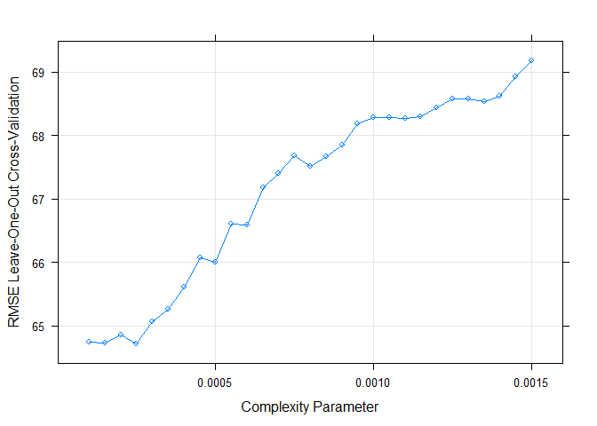
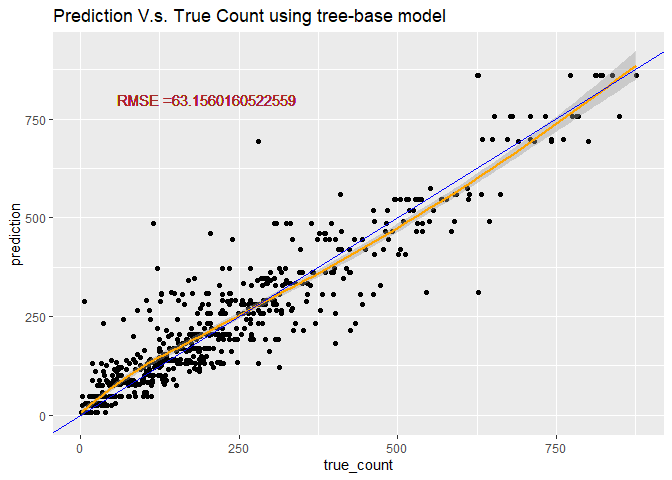

# Require package

```r
#install.packages("render")
library(knitr)
library(rmarkdown)
library(MuMIn)
library(tidyverse)
library(caret)
library(corrplot)
library(readxl)
library(caret)
library(ggiraphExtra)
library(knitr)
library(ggplot2)
library(ggpubr)
library(rpart.plot)
library(rpart)
library(DT)
```

# Read in data

```r
setwd("C:\\Users\\LeeSF\\Desktop\\2020 fall\\ST558")

#read in hour data
HourData <- read.csv("hour.csv")
HourData<- HourData %>% select(-casual, -registered)
HourData$yr <- as.factor(HourData$yr)
HourData$holiday <- as.factor(HourData$holiday)
HourData$workingday <- as.factor(HourData$workingday)

#filter data by weekday
HourData <-HourData %>% filter(weekday==params$w)
#showing data
HourData <-HourData %>% select(-weekday, -workingday,-instant)
tbl_df(HourData)
```

```
## # A tibble: 2,453 x 12
##    dteday season yr     mnth    hr holiday weathersit  temp atemp   hum
##    <chr>   <int> <fct> <int> <int> <fct>        <int> <dbl> <dbl> <dbl>
##  1 2011-~      1 0         1     0 0                1  0.16 0.182  0.55
##  2 2011-~      1 0         1     1 0                1  0.16 0.182  0.59
##  3 2011-~      1 0         1     2 0                1  0.14 0.152  0.63
##  4 2011-~      1 0         1     4 0                1  0.14 0.182  0.63
##  5 2011-~      1 0         1     5 0                1  0.12 0.152  0.68
##  6 2011-~      1 0         1     6 0                1  0.12 0.152  0.74
##  7 2011-~      1 0         1     7 0                1  0.12 0.152  0.74
##  8 2011-~      1 0         1     8 0                1  0.14 0.152  0.69
##  9 2011-~      1 0         1     9 0                1  0.16 0.152  0.64
## 10 2011-~      1 0         1    10 0                2  0.16 0.136  0.69
## # ... with 2,443 more rows, and 2 more variables: windspeed <dbl>, cnt <int>
```

```r
#Separate dataset into train (70%) and test (30%) data set
set.seed(1997)
train <- sample(1:nrow(HourData), size = nrow(HourData)*0.7)
test <- dplyr::setdiff(1:nrow(HourData), train)
HourDataTrain <- HourData[train, ]
HourDataTest <- HourData[test, ]
```

# Summarize the training data

```r
# plot the histogram of rental count
hist <- ggplot(data=HourDataTrain, aes(x=cnt))+geom_histogram(binwidth = 20, aes(color=yr))
hist <-hist+labs(title="Histogram of the retal count", x="rental count")
hist <-hist+scale_fill_discrete(labels=c(2011,2012))
hist
```


```r
#prin out summary table for tempature humidity and windspeed
sum <- HourDataTrain%>% select(c(temp, atemp, hum, windspeed))
kable(apply(sum, 2,summary), caption="Numeric Summary for weather measurement")
```


Table: Numeric Summary for weather measurement

|        |      temp|     atemp|       hum| windspeed|
|:-------|---------:|---------:|---------:|---------:|
|Min.    | 0.1000000| 0.0909000| 0.1600000| 0.0000000|
|1st Qu. | 0.3600000| 0.3485000| 0.4900000| 0.1045000|
|Median  | 0.5200000| 0.5000000| 0.6600000| 0.1940000|
|Mean    | 0.5076179| 0.4861924| 0.6405649| 0.1928702|
|3rd Qu. | 0.6600000| 0.6212000| 0.8100000| 0.2836000|
|Max.    | 0.9400000| 0.8485000| 1.0000000| 0.7761000|

```r
#plot the boxplot of tempature humidity and windspeed (not genralized amount)
#plot base
boxplot <- ggplot(data = HourDataTrain, aes(x=season))
#adding 4 variables
tem <-boxplot+geom_boxplot(aes(y=temp*41, group=season))+labs(y="Tempature (c)", title = "boxplot for weather measurement")
fetem <-boxplot+geom_boxplot(aes(y=atemp*50, group=season))+labs(y="Feeling Tempature (c)")
hum <-boxplot+geom_boxplot(aes(y=hum*100, group=season))+labs(y="Humidity")
wind <-boxplot+geom_boxplot(aes(y=windspeed*67, group=season))+labs(y="Wind Speed")
#combine 4 plots into 1
ggarrange(tem, fetem, hum , wind, ncol = 2, nrow = 2)
```


```r
# plot the count distribution among time and weather
# by time
barplot1<-ggplot(data = HourDataTrain, aes(x=hr))+geom_col(aes(y=cnt, fill=yr))+facet_wrap(~mnth)
barplot1 <- barplot1+labs(x="time", y="Rental Count", title="Retal count distribution by month" )
barplot1+scale_fill_discrete(name="year", labels=c(2011,2012))
```


```r
# by weather
barplot2 <-ggplot(data = HourDataTrain, aes(x=weathersit))+geom_col(aes(y=cnt, fill=yr))+facet_wrap(~mnth)
barplot2 <- barplot2+labs(x="Weather situation, 1: clear day, 2: misty day, 3:rain or snow", y="Rental Count", title="Retal count distribution by month" )
barplot2+scale_fill_discrete(name="year", labels=c(2011,2012))
```


# Training Model
Here I use two different method, First one useing a tree-based models using leave one out cross validation. Second, I use the boosted tree model with cross validation. Both two training are done using the `train` function from `caret` package. The data was cantered and scaled before training.Since our response variables is continuous response, I choose to use Regression tree.

## Tree-based model

```r
# set up training control, using leave one out cross validation.
set.seed(615)
trctrl <- trainControl(method = "LOOCV", number = 1)

# getModelInfo("rpart")
# training using regression tree models with cp in [0.001, 0.002]
# since the cp seems have to be really small when I used the default cp to train

model1 <- cnt~season+yr+mnth+hr+holiday+weathersit+temp+atemp+hum+windspeed

RegTree_fit1 <- train(model1, data = HourDataTrain, method = "rpart",
                 trControl=trctrl,
                 preProcess = c("center", "scale"),
                 tuneGrid=expand.grid(cp=seq(0.001,0.002,0.00005))
)

# show the training result
RegTree_fit1
```

```
## CART 
## 
## 1717 samples
##   10 predictor
## 
## Pre-processing: centered (10), scaled (10) 
## Resampling: Leave-One-Out Cross-Validation 
## Summary of sample sizes: 1716, 1716, 1716, 1716, 1716, 1716, ... 
## Resampling results across tuning parameters:
## 
##   cp       RMSE      Rsquared   MAE     
##   0.00100  68.28331  0.8675589  41.82862
##   0.00105  68.27790  0.8675744  41.93307
##   0.00110  68.26696  0.8676161  41.88001
##   0.00115  68.29695  0.8674245  41.90718
##   0.00120  68.44078  0.8667863  42.09465
##   0.00125  68.57272  0.8662395  42.25689
##   0.00130  68.57923  0.8662009  42.17104
##   0.00135  68.53295  0.8663840  42.13261
##   0.00140  68.61089  0.8660734  42.15626
##   0.00145  68.91684  0.8649382  42.20593
##   0.00150  69.16913  0.8639396  42.41918
##   0.00155  69.20888  0.8637616  42.36207
##   0.00160  69.53090  0.8625094  42.55976
##   0.00165  70.01340  0.8606485  43.03097
##   0.00170  70.53439  0.8584335  44.00631
##   0.00175  70.05688  0.8602741  43.24789
##   0.00180  69.89580  0.8608996  43.04020
##   0.00185  70.04892  0.8602969  43.07104
##   0.00190  70.00124  0.8604983  43.02908
##   0.00195  70.44255  0.8587770  43.34898
##   0.00200  71.18458  0.8559565  44.02452
## 
## RMSE was used to select the optimal model using the smallest value.
## The final value used for the model was cp = 0.0011.
```

```r
# plot the RMSE of selected cp
plot(RegTree_fit1)
```



```r
# plot my final tree model
rpart.plot(RegTree_fit1$finalModel)
```


## Boosted tree model

```r
# set up training control, using cross validation with 10 folder
set.seed(615)
trctrl <- trainControl(method = "cv", number = 10)

# training using boosted tree models with boosting interation in [200,400] and try max tree depth 5~9
model2 <- cnt~season+yr+mnth+hr+holiday+weathersit+temp+atemp+hum+windspeed
RegTree_fit2 <- train(model2, data = HourDataTrain, method = "bstTree",
                trControl=trctrl,
                preProcess = c("center", "scale"),
                tuneGrid=expand.grid(mstop=seq(200,400,10),
                                     maxdepth=5:9, nu=0.1)
                 )

# show the training result
RegTree_fit2
```

```
## Boosted Tree 
## 
## 1717 samples
##   10 predictor
## 
## Pre-processing: centered (10), scaled (10) 
## Resampling: Cross-Validated (10 fold) 
## Summary of sample sizes: 1546, 1545, 1545, 1544, 1544, 1546, ... 
## Resampling results across tuning parameters:
## 
##   maxdepth  mstop  RMSE      Rsquared   MAE     
##   5         200    43.72996  0.9454627  26.53890
##   5         210    43.72626  0.9455030  26.55175
##   5         220    43.72894  0.9454868  26.55686
##   5         230    43.65670  0.9456704  26.52941
##   5         240    43.65422  0.9456897  26.58357
##   5         250    43.62780  0.9457472  26.57713
##   5         260    43.63729  0.9457227  26.61883
##   5         270    43.72173  0.9455120  26.68945
##   5         280    43.73100  0.9454968  26.69611
##   5         290    43.69038  0.9455919  26.69717
##   5         300    43.71859  0.9455605  26.70453
##   5         310    43.73531  0.9455267  26.72989
##   5         320    43.77927  0.9454363  26.75075
##   5         330    43.77916  0.9454318  26.75821
##   5         340    43.79496  0.9453816  26.77516
##   5         350    43.79776  0.9453806  26.78170
##   5         360    43.79434  0.9453987  26.78087
##   5         370    43.81617  0.9453403  26.77529
##   5         380    43.85618  0.9452671  26.81395
##   5         390    43.85871  0.9452549  26.83576
##   5         400    43.89788  0.9451764  26.87727
##   6         200    43.38152  0.9461417  26.12302
##   6         210    43.40219  0.9460912  26.17599
##   6         220    43.41254  0.9460563  26.18057
##   6         230    43.48659  0.9458694  26.23218
##   6         240    43.51202  0.9458098  26.25074
##   6         250    43.55986  0.9456866  26.28299
##   6         260    43.55327  0.9457105  26.28804
##   6         270    43.58245  0.9456504  26.32203
##   6         280    43.60693  0.9455772  26.35425
##   6         290    43.67102  0.9454226  26.39562
##   6         300    43.70983  0.9453067  26.43263
##   6         310    43.73799  0.9452311  26.44797
##   6         320    43.75304  0.9452042  26.48414
##   6         330    43.80923  0.9450573  26.52144
##   6         340    43.77450  0.9451584  26.52932
##   6         350    43.83174  0.9450103  26.57389
##   6         360    43.85914  0.9449408  26.62000
##   6         370    43.87136  0.9449126  26.63961
##   6         380    43.90458  0.9448351  26.68491
##   6         390    43.91105  0.9448308  26.69790
##   6         400    43.91391  0.9448256  26.72112
##   7         200    44.07484  0.9447905  26.29446
##   7         210    44.09240  0.9447578  26.32569
##   7         220    44.13183  0.9446490  26.39759
##   7         230    44.21262  0.9444319  26.46004
##   7         240    44.24637  0.9443359  26.51085
##   7         250    44.30598  0.9442015  26.54825
##   7         260    44.32052  0.9441612  26.58889
##   7         270    44.33737  0.9440956  26.62589
##   7         280    44.36897  0.9440059  26.67210
##   7         290    44.37163  0.9439931  26.70158
##   7         300    44.43331  0.9438396  26.76935
##   7         310    44.47930  0.9437473  26.82377
##   7         320    44.52480  0.9436315  26.86562
##   7         330    44.54506  0.9436028  26.89195
##   7         340    44.56720  0.9435493  26.92993
##   7         350    44.55925  0.9435858  26.93264
##   7         360    44.58401  0.9435236  26.98107
##   7         370    44.61344  0.9434609  27.02035
##   7         380    44.67809  0.9432994  27.06277
##   7         390    44.73503  0.9431594  27.09588
##   7         400    44.75718  0.9431140  27.12755
##   8         200    44.38810  0.9436105  26.14484
##   8         210    44.41584  0.9435615  26.22226
##   8         220    44.45628  0.9434685  26.25324
##   8         230    44.43113  0.9435142  26.26809
##   8         240    44.51772  0.9433163  26.35085
##   8         250    44.56147  0.9432276  26.40314
##   8         260    44.60516  0.9431041  26.46045
##   8         270    44.60373  0.9430981  26.47955
##   8         280    44.62901  0.9430329  26.52413
##   8         290    44.67442  0.9429210  26.54991
##   8         300    44.71293  0.9428220  26.60798
##   8         310    44.74133  0.9427513  26.65822
##   8         320    44.77003  0.9426816  26.69107
##   8         330    44.76610  0.9427039  26.70627
##   8         340    44.77204  0.9426841  26.72322
##   8         350    44.80046  0.9426087  26.74979
##   8         360    44.79406  0.9426227  26.75825
##   8         370    44.81566  0.9425690  26.78561
##   8         380    44.80375  0.9425961  26.79055
##   8         390    44.79934  0.9426068  26.80425
##   8         400    44.82207  0.9425487  26.81699
##   9         200    44.30686  0.9440953  26.10887
##   9         210    44.36321  0.9439654  26.18271
##   9         220    44.37525  0.9439467  26.20165
##   9         230    44.40267  0.9438902  26.23059
##   9         240    44.42021  0.9438442  26.25399
##   9         250    44.45067  0.9437667  26.26471
##   9         260    44.44416  0.9437819  26.27519
##   9         270    44.46486  0.9437303  26.30461
##   9         280    44.48720  0.9436713  26.32708
##   9         290    44.50395  0.9436142  26.35471
##   9         300    44.50152  0.9436267  26.35964
##   9         310    44.53592  0.9435383  26.39037
##   9         320    44.58522  0.9434153  26.42647
##   9         330    44.60750  0.9433569  26.45694
##   9         340    44.64310  0.9432679  26.49023
##   9         350    44.67755  0.9431865  26.52671
##   9         360    44.68570  0.9431627  26.54643
##   9         370    44.68782  0.9431526  26.55539
##   9         380    44.70855  0.9431002  26.56851
##   9         390    44.71672  0.9430801  26.57323
##   9         400    44.73347  0.9430463  26.60013
## 
## Tuning parameter 'nu' was held constant at a value of 0.1
## RMSE was used to select the optimal model using the smallest value.
## The final values used for the model were mstop = 200, maxdepth = 6 and nu = 0.1.
```

```r
# plot the RMSE of selected parameters
plot(RegTree_fit2)
```


# Predicting using the best tree-base model 

```r
# predict use predict function
tree_pred <- predict(RegTree_fit1, newdata = HourDataTest)

#Calculate the Root MSE
RMSE_tree<- sqrt(mean((tree_pred-HourDataTest$cnt)^2))
label <- paste0("RMSE =", RMSE_tree)

# plot the prediction
count <- data.frame(true_count=HourDataTest$cnt,prediction=tree_pred )
predPlot <- ggplot(data=count, aes(x=true_count,y=prediction))
predPlot <- predPlot+labs(title="Prediction V.s. True Count using tree-base model")+geom_point()
predPlot <- predPlot+geom_smooth(color="orange")+geom_abline(aes(intercept=0,slope=1), color="blue")
predPlot <- predPlot+geom_text(x=200, y=800,label=label, color="brown")
predPlot
```



# Predicting using the best boosted-tree model 

```r
# predict use predict function
boosted_pred <- predict(RegTree_fit2, newdata = HourDataTest)

#Calculate the Root MSE
RMSE_boosted <- sqrt(mean((boosted_pred-HourDataTest$cnt)^2))
lab <- paste0("RMSE =", RMSE_boosted)
# plot the prediction
count2 <- data.frame(True_count=HourDataTest$cnt,prediction=boosted_pred )
pred_plot <- ggplot(data=count2, aes(x=True_count,y=prediction))
pred_plot <- pred_plot+labs(title="Prediction V.s. True Count using boosted model")+geom_point()
pred_plot <- pred_plot+geom_smooth(color="orange")+geom_abline(aes(intercept=0,slope=1), color="blue")
pred_plot <- pred_plot+geom_text(x=200, y=800,label=lab, color=" brown")
pred_plot
```


