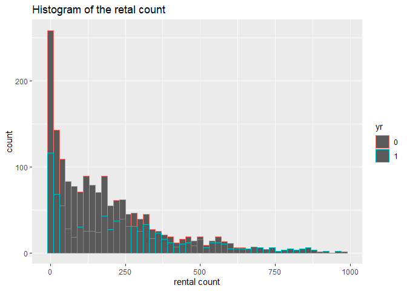
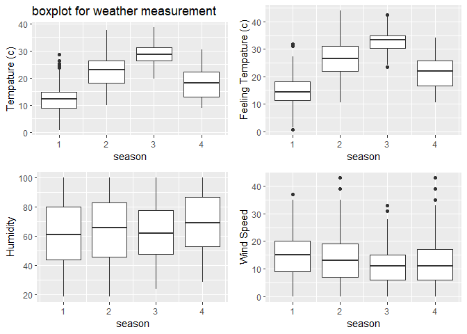
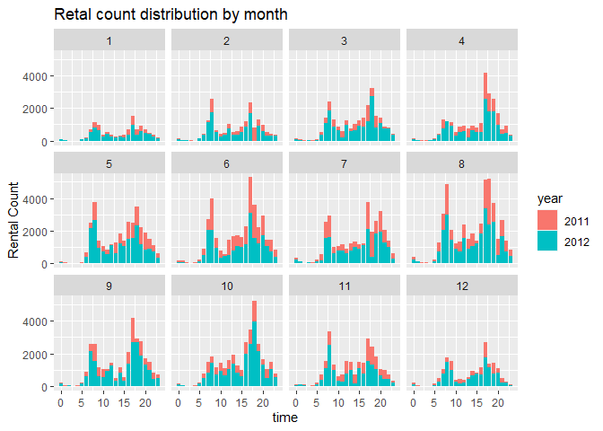
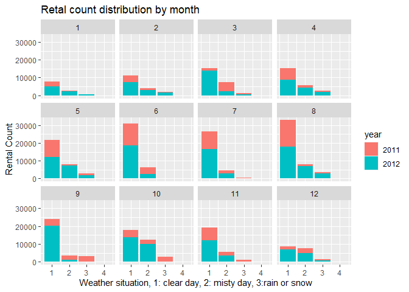
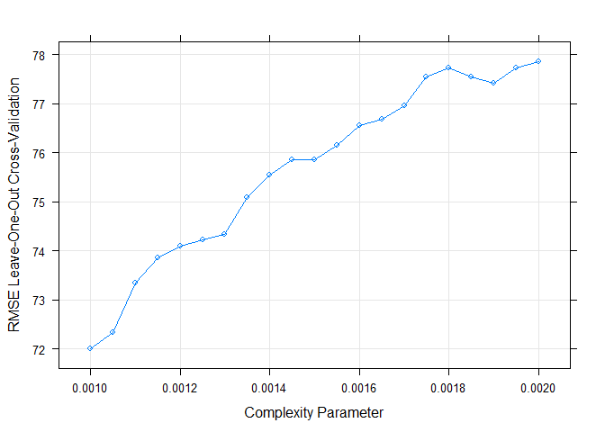
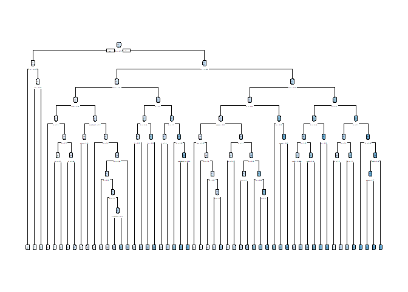
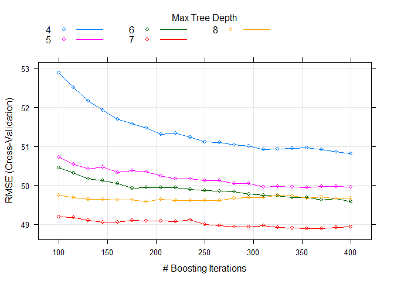
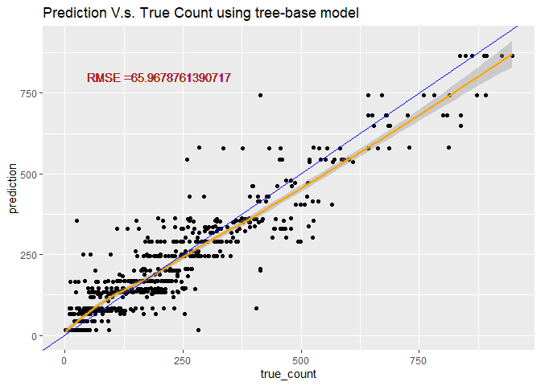
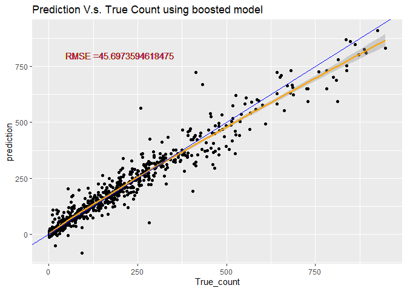

# Require package

```r
#install.packages("render")
library(knitr)
library(rmarkdown)
library(MuMIn)
library(tidyverse)
library(caret)
library(corrplot)
library(readxl)
library(caret)
library(ggiraphExtra)
library(knitr)
library(ggplot2)
library(ggpubr)
library(rpart.plot)
library(rpart)
library(DT)
```

# Read in data

```r
#read in hour data
HourData <- read.csv("hour.csv")
HourData<- HourData %>% select(-casual, -registered)
HourData$yr <- as.factor(HourData$yr)
HourData$holiday <- as.factor(HourData$holiday)
HourData$workingday <- as.factor(HourData$workingday)

#filter data by weekday
HourData <-HourData %>% filter(weekday==params$w)
#showing data
HourData <-HourData %>% select(-weekday, -workingday,-instant)
tbl_df(HourData)
```

```
## # A tibble: 2,475 x 12
##    dteday season yr     mnth    hr holiday weathersit  temp atemp   hum
##    <chr>   <int> <fct> <int> <int> <fct>        <int> <dbl> <dbl> <dbl>
##  1 2011-~      1 0         1     0 0                1  0.2  0.258  0.64
##  2 2011-~      1 0         1     1 0                1  0.16 0.197  0.74
##  3 2011-~      1 0         1     2 0                1  0.16 0.197  0.74
##  4 2011-~      1 0         1     4 0                1  0.24 0.227  0.48
##  5 2011-~      1 0         1     5 0                1  0.22 0.227  0.47
##  6 2011-~      1 0         1     6 0                1  0.2  0.197  0.47
##  7 2011-~      1 0         1     7 0                1  0.18 0.182  0.43
##  8 2011-~      1 0         1     8 0                1  0.2  0.182  0.4 
##  9 2011-~      1 0         1     9 0                1  0.22 0.197  0.37
## 10 2011-~      1 0         1    10 0                1  0.22 0.197  0.37
## # ... with 2,465 more rows, and 2 more variables: windspeed <dbl>, cnt <int>
```

```r
#Separate dataset into train (70%) and test (30%) data set
set.seed(1997)
train <- sample(1:nrow(HourData), size = nrow(HourData)*0.7)
test <- dplyr::setdiff(1:nrow(HourData), train)
HourDataTrain <- HourData[train, ]
HourDataTest <- HourData[test, ]
```

# Summarize the training data

```r
# plot the histogram of rental count
hist <- ggplot(data=HourDataTrain, aes(x=cnt))+geom_histogram(binwidth = 20, aes(color=yr))
hist <-hist+labs(title="Histogram of the retal count", x="rental count")
hist <-hist+scale_fill_discrete(labels=c(2011,2012))
hist
```



```r
#prin out summary table for tempature humidity and windspeed
sum <- HourDataTrain%>% select(c(temp, atemp, hum, windspeed))
kable(apply(sum, 2,summary), caption="Numeric Summary for weather measurement")
```


Table: Numeric Summary for weather measurement

|        |      temp|     atemp|       hum| windspeed|
|:-------|---------:|---------:|---------:|---------:|
|Min.    | 0.0200000| 0.0152000| 0.1900000| 0.0000000|
|1st Qu. | 0.3400000| 0.3333000| 0.4800000| 0.1045000|
|Median  | 0.5200000| 0.5000000| 0.6500000| 0.1642000|
|Mean    | 0.5056005| 0.4826364| 0.6409296| 0.1854523|
|3rd Qu. | 0.6600000| 0.6212000| 0.8100000| 0.2836000|
|Max.    | 0.9400000| 0.8788000| 1.0000000| 0.6418000|

```r
#plot the boxplot of tempature humidity and windspeed (not genralized amount)
#plot base
boxplot <- ggplot(data = HourDataTrain, aes(x=season))
#adding 4 variables
tem <-boxplot+geom_boxplot(aes(y=temp*41, group=season))+labs(y="Tempature (c)", title = "boxplot for weather measurement")
fetem <-boxplot+geom_boxplot(aes(y=atemp*50, group=season))+labs(y="Feeling Tempature (c)")
hum <-boxplot+geom_boxplot(aes(y=hum*100, group=season))+labs(y="Humidity")
wind <-boxplot+geom_boxplot(aes(y=windspeed*67, group=season))+labs(y="Wind Speed")
#combine 4 plots into 1
ggarrange(tem, fetem, hum , wind, ncol = 2, nrow = 2)
```



```r
# plot the count distribution among time and weather
# by time
barplot1<-ggplot(data = HourDataTrain, aes(x=hr))+geom_col(aes(y=cnt, fill=yr))+facet_wrap(~mnth)
barplot1 <- barplot1+labs(x="time", y="Rental Count", title="Retal count distribution by month" )
barplot1+scale_fill_discrete(name="year", labels=c(2011,2012))
```



```r
# by weather
barplot2 <-ggplot(data = HourDataTrain, aes(x=weathersit))+geom_col(aes(y=cnt, fill=yr))+facet_wrap(~mnth)
barplot2 <- barplot2+labs(x="Weather situation, 1: clear day, 2: misty day, 3:rain or snow", y="Rental Count", title="Retal count distribution by month" )
barplot2+scale_fill_discrete(name="year", labels=c(2011,2012))
```



# Training Model
Here I use two different method, First one useing a tree-based models using leave one out cross validation. Second, I use the boosted tree model with cross validation. Both two training are done using the `train` function from `caret` package. The data was cantered and scaled before training.Since our response variables is continuous response, I choose to use Regression tree.

## Tree-based model

```r
# set up training control, using leave one out cross validation.
set.seed(615)
trctrl <- trainControl(method = "LOOCV", number = 1)

# getModelInfo("rpart")
# training using regression tree models with cp in [0.001, 0.002]
# since the cp seems have to be really small when I used the default cp to train

model1 <- cnt~season+yr+mnth+hr+holiday+weathersit+temp+atemp+hum+windspeed

RegTree_fit1 <- train(model1, data = HourDataTrain, method = "rpart",
                 trControl=trctrl,
                 preProcess = c("center", "scale"),
                 tuneGrid=expand.grid(cp=seq(0.0001,0.0015,0.00005))
)

# show the training result
RegTree_fit1
```

```
## CART 
## 
## 1732 samples
##   10 predictor
## 
## Pre-processing: centered (10), scaled (10) 
## Resampling: Leave-One-Out Cross-Validation 
## Summary of sample sizes: 1731, 1731, 1731, 1731, 1731, 1731, ... 
## Resampling results across tuning parameters:
## 
##   cp       RMSE      Rsquared   MAE     
##   0.00010  69.34262  0.8689469  40.72888
##   0.00015  69.51037  0.8683072  41.06709
##   0.00020  69.85673  0.8669561  41.67236
##   0.00025  69.56816  0.8679912  41.34830
##   0.00030  69.77883  0.8672371  41.72130
##   0.00035  69.86938  0.8668333  42.44413
##   0.00040  70.02982  0.8662326  42.65674
##   0.00045  70.26831  0.8652776  43.60049
##   0.00050  70.57485  0.8641321  44.30955
##   0.00055  70.62266  0.8639044  44.22219
##   0.00060  70.65559  0.8637801  44.33198
##   0.00065  70.67396  0.8636958  44.30527
##   0.00070  71.00254  0.8624255  44.80213
##   0.00075  70.98904  0.8624707  44.75765
##   0.00080  71.04344  0.8622689  44.79136
##   0.00085  70.98973  0.8624882  44.78090
##   0.00090  71.09150  0.8620800  44.64318
##   0.00095  71.29513  0.8613426  44.63109
##   0.00100  72.01364  0.8585990  45.30242
##   0.00105  72.34355  0.8573491  45.53370
##   0.00110  73.34029  0.8534779  46.29823
##   0.00115  73.86703  0.8512623  47.11151
##   0.00120  74.09519  0.8503553  47.16447
##   0.00125  74.22247  0.8497861  47.07405
##   0.00130  74.32885  0.8493557  47.21251
##   0.00135  75.09666  0.8463183  47.69511
##   0.00140  75.54842  0.8444650  48.13520
##   0.00145  75.85630  0.8431323  48.49751
##   0.00150  75.85616  0.8431168  48.32183
## 
## RMSE was used to select the optimal model using the smallest value.
## The final value used for the model was cp = 1e-04.
```

```r
# plot the RMSE of selected cp
plot(RegTree_fit1)
```



```r
# plot my final tree model
rpart.plot(RegTree_fit1$finalModel)
```



## Boosted tree model

```r
# set up training control, using cross validation with 10 folder
set.seed(615)
trctrl <- trainControl(method = "cv", number = 10)

# training using boosted tree models with boosting interation in [200,400] and try max tree depth 5~9
model2 <- cnt~season+yr+mnth+hr+holiday+weathersit+temp+atemp+hum+windspeed
RegTree_fit2 <- train(model2, data = HourDataTrain, method = "bstTree",
                trControl=trctrl,
                preProcess = c("center", "scale"),
                tuneGrid=expand.grid(mstop=seq(100,400,15),
                                     maxdepth=4:8, nu=0.1)
                 )

# show the training result
RegTree_fit2
```

```
## Boosted Tree 
## 
## 1732 samples
##   10 predictor
## 
## Pre-processing: centered (10), scaled (10) 
## Resampling: Cross-Validated (10 fold) 
## Summary of sample sizes: 1558, 1559, 1559, 1557, 1558, 1560, ... 
## Resampling results across tuning parameters:
## 
##   maxdepth  mstop  RMSE      Rsquared   MAE     
##   4         100    52.88509  0.9246684  31.12897
##   4         115    52.51243  0.9255046  30.90026
##   4         130    52.16368  0.9263225  30.65520
##   4         145    51.92588  0.9268545  30.46506
##   4         160    51.70079  0.9274544  30.33988
##   4         175    51.58020  0.9276390  30.23507
##   4         190    51.48323  0.9278956  30.18715
##   4         205    51.31950  0.9282901  30.08390
##   4         220    51.34095  0.9281727  30.08301
##   4         235    51.23062  0.9284180  29.98879
##   4         250    51.12045  0.9286945  29.89906
##   4         265    51.10682  0.9286622  29.86966
##   4         280    51.03525  0.9288102  29.83123
##   4         295    51.01904  0.9287842  29.80836
##   4         310    50.91974  0.9290502  29.79748
##   4         325    50.93599  0.9290096  29.81866
##   4         340    50.94963  0.9289415  29.81115
##   4         355    50.96330  0.9288840  29.81698
##   4         370    50.92959  0.9288993  29.79471
##   4         385    50.86605  0.9290628  29.75611
##   4         400    50.81097  0.9292030  29.73183
##   5         100    50.73125  0.9302974  28.91516
##   5         115    50.54583  0.9306114  28.74579
##   5         130    50.42210  0.9308193  28.58262
##   5         145    50.47687  0.9304986  28.55002
##   5         160    50.34298  0.9308288  28.48809
##   5         175    50.38420  0.9306399  28.50880
##   5         190    50.35782  0.9306894  28.50246
##   5         205    50.23973  0.9309866  28.44678
##   5         220    50.16360  0.9311129  28.40848
##   5         235    50.17479  0.9310508  28.39744
##   5         250    50.12260  0.9311566  28.36629
##   5         265    50.12718  0.9311176  28.38105
##   5         280    50.05281  0.9312846  28.36016
##   5         295    50.05417  0.9312535  28.37030
##   5         310    49.96731  0.9314937  28.35614
##   5         325    49.97752  0.9314218  28.39222
##   5         340    49.96299  0.9314123  28.38255
##   5         355    49.93875  0.9314403  28.40492
##   5         370    49.97306  0.9313445  28.41824
##   5         385    49.97078  0.9313292  28.40792
##   5         400    49.95869  0.9313562  28.41266
##   6         100    50.46036  0.9306962  28.33129
##   6         115    50.31340  0.9310713  28.22681
##   6         130    50.17150  0.9314104  28.19627
##   6         145    50.12516  0.9314765  28.18217
##   6         160    50.04330  0.9316760  28.12558
##   6         175    49.93718  0.9319106  28.09567
##   6         190    49.94050  0.9319018  28.13642
##   6         205    49.93798  0.9318790  28.15597
##   6         220    49.94434  0.9318650  28.17912
##   6         235    49.90002  0.9319370  28.16934
##   6         250    49.86703  0.9320163  28.16349
##   6         265    49.85169  0.9320598  28.18585
##   6         280    49.84699  0.9320457  28.20672
##   6         295    49.77878  0.9321800  28.21451
##   6         310    49.74794  0.9322582  28.22960
##   6         325    49.73391  0.9322805  28.27059
##   6         340    49.69470  0.9323741  28.29734
##   6         355    49.69285  0.9323512  28.34722
##   6         370    49.63435  0.9324859  28.38330
##   6         385    49.66283  0.9324133  28.42223
##   6         400    49.58703  0.9326001  28.42141
##   7         100    49.19913  0.9334882  27.91788
##   7         115    49.17643  0.9335577  27.95316
##   7         130    49.10876  0.9337236  27.89716
##   7         145    49.05725  0.9337823  27.95257
##   7         160    49.05657  0.9337689  27.95265
##   7         175    49.09607  0.9336234  28.03080
##   7         190    49.08126  0.9336445  28.04716
##   7         205    49.08150  0.9336163  28.07447
##   7         220    49.07100  0.9336549  28.11949
##   7         235    49.12307  0.9335390  28.12073
##   7         250    48.99432  0.9339118  28.16580
##   7         265    48.97164  0.9339474  28.18862
##   7         280    48.94099  0.9340786  28.20289
##   7         295    48.93939  0.9340965  28.24504
##   7         310    48.96499  0.9340514  28.27800
##   7         325    48.92377  0.9341369  28.31213
##   7         340    48.91276  0.9341731  28.31408
##   7         355    48.88888  0.9342501  28.29981
##   7         370    48.89877  0.9342084  28.36984
##   7         385    48.91787  0.9341779  28.41192
##   7         400    48.93770  0.9341387  28.43792
##   8         100    49.75441  0.9320025  28.00910
##   8         115    49.68356  0.9322108  27.99220
##   8         130    49.64410  0.9322989  27.91650
##   8         145    49.65150  0.9322439  27.90402
##   8         160    49.62350  0.9323399  27.94428
##   8         175    49.62331  0.9323357  27.90713
##   8         190    49.58698  0.9324020  27.92605
##   8         205    49.64737  0.9322032  27.98497
##   8         220    49.62076  0.9322737  27.96193
##   8         235    49.61955  0.9323008  27.98467
##   8         250    49.61571  0.9323106  27.98683
##   8         265    49.61471  0.9323326  28.01655
##   8         280    49.68081  0.9321282  28.07416
##   8         295    49.68327  0.9321132  28.07633
##   8         310    49.69063  0.9320973  28.12395
##   8         325    49.74888  0.9319196  28.16524
##   8         340    49.74073  0.9319618  28.19318
##   8         355    49.67766  0.9321150  28.19984
##   8         370    49.69752  0.9320847  28.23341
##   8         385    49.66554  0.9321552  28.24434
##   8         400    49.66823  0.9321296  28.28021
## 
## Tuning parameter 'nu' was held constant at a value of 0.1
## RMSE was used to select the optimal model using the smallest value.
## The final values used for the model were mstop = 355, maxdepth = 7 and nu = 0.1.
```

```r
# plot the RMSE of selected parameters
plot(RegTree_fit2)
```




# Predicting using the best tree-base model 

```r
# predict use predict function
tree_pred <- predict(RegTree_fit1, newdata = HourDataTest)

#Calculate the Root MSE
RMSE_tree<- sqrt(mean((tree_pred-HourDataTest$cnt)^2))
label <- paste0("RMSE =", RMSE_tree)

# plot the prediction
count <- data.frame(true_count=HourDataTest$cnt,prediction=tree_pred )
predPlot <- ggplot(data=count, aes(x=true_count,y=prediction))
predPlot <- predPlot+labs(title="Prediction V.s. True Count using tree-base model")+geom_point()
predPlot <- predPlot+geom_smooth(color="orange")+geom_abline(aes(intercept=0,slope=1), color="blue")
predPlot <- predPlot+geom_text(x=200, y=800,label=label, color="brown")
predPlot
```



# Predicting using the best boosted-tree model 

```r
# predict use predict function
boosted_pred <- predict(RegTree_fit2, newdata = HourDataTest)

#Calculate the Root MSE
RMSE_boosted <- sqrt(mean((boosted_pred-HourDataTest$cnt)^2))
lab <- paste0("RMSE =", RMSE_boosted)
# plot the prediction
count2 <- data.frame(True_count=HourDataTest$cnt,prediction=boosted_pred )
pred_plot <- ggplot(data=count2, aes(x=True_count,y=prediction))
pred_plot <- pred_plot+labs(title="Prediction V.s. True Count using boosted model")+geom_point()
pred_plot <- pred_plot+geom_smooth(color="orange")+geom_abline(aes(intercept=0,slope=1), color="blue")
pred_plot <- pred_plot+geom_text(x=200, y=800,label=lab, color=" brown")
pred_plot
```


